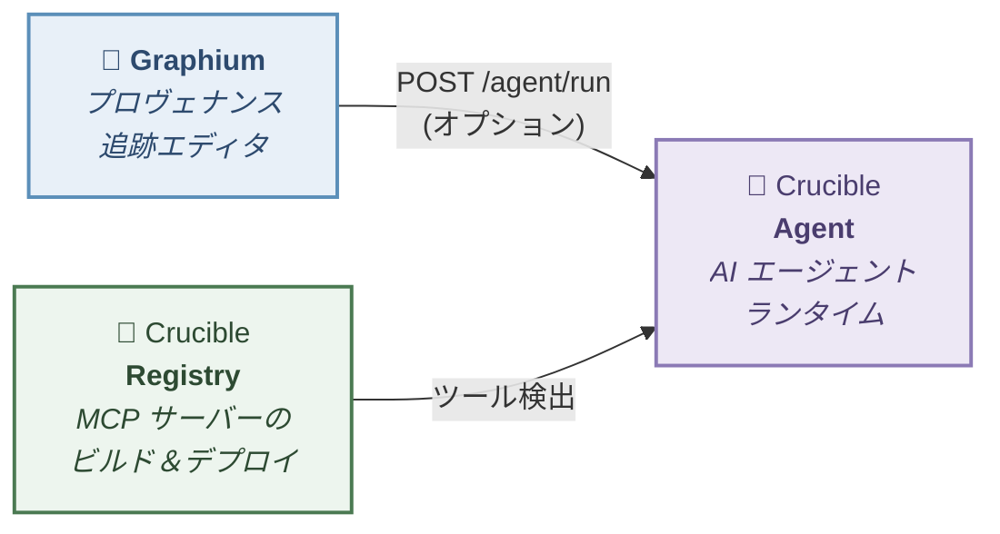

<p align="center">
  
</p>
<h1 align="center">Graphium</h1>
<p align="center">
  <b>PROV-DM</b> プロヴェナンス追跡機能付きブロックエディタ — <a href="https://www.blocknotejs.org/">BlockNote.js</a> ベース
</p>
<p align="center">
  <a href="README.md">English</a> | <b>日本語</b>
</p>

Graphium は、科学ノートのあり方を再考する試みです。小さなアイデアをリンクして思わぬ発見につなげる [Zettelkasten](https://ja.wikipedia.org/wiki/%E3%83%84%E3%82%A7%E3%83%86%E3%83%AB%E3%82%AB%E3%82%B9%E3%83%86%E3%83%B3) スタイルのノート術と、その発見に正式で追跡可能な来歴を与える W3C 標準 [PROV-DM](https://www.w3.org/TR/prov-dm/) を組み合わせています。AI が加わると、AI が生成した知識も人間のノートと同じ来歴で記録されるため、アイデアの出所を常に把握できます。

## 必要な分だけ使う

Graphium は**段階的開示（progressive disclosure）**を設計の中心に据えています。どこまで深く使うかはユーザー次第です：

| レベル | やること | 得られるもの |
|--------|---------|-------------|
| **ノートだけ** | `@` 参照でノートを書いてリンクする | Google Drive 同期付きの Zettelkasten スタイルのリンクノート |
| **一部にラベル** | 重要なブロックに `#` コンテキストラベルを付ける | ラベルを付けた部分に PROV-DM 構造が生まれ、プロヴェナンスグラフが自動生成される |
| **全面ラベリング** | すべてのブロックに体系的にラベルを付ける | ワークフロー全体の完全なプロヴェナンス追跡 |

**ラベルを何も付けなくても** Graphium の価値は得られます。まずはリンクノートから始めて、特定の実験やプロジェクトで追跡性が必要になったら、重要なブロックだけにラベルを付けてください。プロヴェナンス層はラベルを付けた場所だけで有効になります。

このラベル密度のグラデーションは、制限ではなく**コアの設計判断**です。

## すぐに試す

**[→ GitHub Pages で Graphium を開く](https://kumagallium.github.io/Graphium/)**

インストール不要 — ブラウザで動作します。ノートは Google Drive またはブラウザのローカルストレージに保存されます。

## 相互運用性

Graphium はプロヴェナンスを **[PROV-JSON-LD](https://www.w3.org/submissions/2024/SUBM-prov-jsonld-20240825/)** としてエクスポートします。これは Linked Data 上に構築された W3C 標準であり、独自形式ではありません。PROV-DM や JSON-LD を理解するあらゆるツールが Graphium の出力を利用できます。プロヴェナンスデータは設計上ポータブルです。

## 使い方

### 方法 1: オンラインで使う（セットアップ不要）

**https://kumagallium.github.io/Graphium/** にアクセスして書き始めるだけ。ノートはブラウザのローカルストレージに保存されます。

Google Drive と同期するには、サイドバーから Google アカウントでサインインしてください。

### 方法 2: Docker で起動 — エディタのみ

Graphium をスタンドアロンのエディタとして起動します。AI や外部サービスは不要で、Google Drive 同期付きのノートエディタだけが動作します。

```bash
git clone https://github.com/kumagallium/Graphium.git
cd Graphium
docker compose -f docker-compose.standalone.yml up -d
```

**http://localhost:5174/Graphium/** を開いて書き始められます。

### 方法 3: Docker で起動 — Crucible フルスタック（AI + MCP ツール）

[Crucible](https://github.com/kumagallium/Crucible) フルスタックで Graphium を起動します。AI チャット、ノート派生、プロヴェナンス付き AI 応答、MCP ツール管理が利用可能です。

```bash
git clone https://github.com/kumagallium/Graphium.git
cd Graphium
docker compose up -d
```

| URL | 内容 |
|-----|------|
| http://localhost:5174/Graphium/ | Graphium エディタ |
| http://localhost:8090 | Crucible Agent — AI チャット UI |
| http://localhost:8081 | Crucible Registry — MCP サーバー管理 |

#### AI モデルの設定

1. **http://localhost:8090**（Crucible Agent チャット UI）を開く
2. UI から LLM モデル（Claude、GPT-4o 等）と API キーを追加
3. **http://localhost:5174/Graphium/** で AI アシスタント機能を利用開始

#### MCP ツールの追加（オプション）

1. **http://localhost:8081**（Crucible Registry UI）を開く
2. GitHub リポジトリから MCP サーバーを登録
3. エージェントが登録済みツールを自動的に検出して使用

`.env` の編集は不要 — すべてブラウザから設定できます。Google Drive 同期と Google OAuth はそのまま動作します。

> **注意:** Docker モードでは、すべてのサービスが API キー認証なしで動作し、ローカルマシン（`localhost`）からのみアクセス可能です。

#### 最新バージョンへの更新

```bash
./update.sh
```

または手動で：

```bash
git pull                      # 最新の Graphium コードを取得
docker compose pull           # 最新の Crucible イメージを取得
docker compose up -d --build  # Graphium をリビルドして全サービスを再起動
```

### 方法 4: 開発用に起動

```bash
git clone https://github.com/kumagallium/Graphium.git
cd Graphium
pnpm install
pnpm dev --port 5174   # → http://localhost:5174/Graphium/
```

Google Drive 同期は設定なしで動作します。AI 機能を有効にするには、別途 [Crucible Agent](https://github.com/kumagallium/Crucible-Agent) サーバーが必要です。サイドバーの **⚙ 設定** アイコンからエージェント URL を設定してください。

## 機能一覧

- **コンテキストラベル** — `[手順]`、`[材料]`、`[ツール]`、`[属性]`、`[結果]` を PROV-DM ロールにマッピング
- **ブロック間リンク** — プロヴェナンスセマンティクス付き（`informed_by`、`derived_from`、`used`）
- **マルチページタブエディタ** — スコープ派生対応
- **インデックステーブル** — 関連ノートを表形式で管理、サイドピークプレビュー付き
- **PROV-JSON-LD エクスポート** — W3C 準拠のページ単位プロヴェナンスエクスポート
- **プロヴェナンスグラフ** 可視化（Cytoscape.js + ELK レイアウト）
- **ノート間ネットワークグラフ**（Cytoscape.js + fcose レイアウト）
- **AI アシスタント** — AI 応答からプロヴェナンスメタデータ付きのノートを派生
- **Google Drive ストレージ** — `.graphium.json` ファイルとして保存
- **Google OAuth 2.0** 認証

### スクリーンショット

<table>
  <tr>
    <td><b>コンテキストラベル付きエディタ & サイドバー</b></td>
    <td><b>プロヴェナンスグラフ（PROV-DM）</b></td>
  </tr>
  <tr>
    <td></td>
    <td></td>
  </tr>
  <tr>
    <td><b>ノート間ネットワークグラフ</b></td>
    <td><b>ラベルギャラリー（インデックステーブル）</b></td>
  </tr>
  <tr>
    <td></td>
    <td></td>
  </tr>
</table>

## PROV-DM 準拠

Graphium は、[W3C PROV Data Model (PROV-DM)](https://www.w3.org/TR/prov-dm/) に準拠した**2層プロヴェナンスモデル**を実装しています。

### 第1層: コンテンツプロヴェナンス — 実験ワークフロー

ドキュメントブロックのコンテキストラベルは PROV-DM 概念にマッピングされます：

| ラベル | PROV-DM 型 | Entity サブタイプ | 説明 |
|--------|-----------|-----------------|------|
| `[手順]` | `prov:Activity` | — | 実験ステップ |
| `[材料]` | `prov:Entity` | `material` | プロセスで変換される物質 |
| `[ツール]` | `prov:Entity` | `tool` | 装置・器具 |
| `[属性]` | Property | — | 親ノードに埋め込まれるパラメータ |
| `[結果]` | `prov:Entity` | — | Activity から生成される出力 |

関係: `prov:used`（Usage）、`prov:wasGeneratedBy`（Generation）、`prov:wasInformedBy`（前手順リンク経由）

### 第2層: ドキュメントプロヴェナンス — 編集履歴

保存ごとにリビジョンチェーンが PROV-DM として記録されます：

| 概念 | PROV-DM マッピング |
|------|-------------------|
| エディタ（人間または AI） | `prov:Agent` |
| 編集操作 | `prov:Activity`（`startTime` / `endTime` 付き） |
| ドキュメントリビジョン | `prov:Entity`（`prov:generatedAtTime` 付き） |
| エディタ → 編集 | `prov:Association` |
| 編集 → リビジョン | `prov:Generation` |
| リビジョン → 前リビジョン | `prov:Derivation` |

ドキュメントプロヴェナンスはコンテンツプロヴェナンスとは別に `prov:Bundle` としてエクスポートされます。

### PROV-JSON-LD エクスポート

ページ単位のエクスポートは [W3C PROV-JSON-LD 仕様](https://www.w3.org/submissions/2024/SUBM-prov-jsonld-20240825/)に準拠しています：

- [openprovenance コンテキスト](https://openprovenance.org/prov-jsonld/context.jsonld)を使用
- プレフィックスなしの `@type` 値（`Entity`、`Activity`、`Agent`）
- 関係を独立オブジェクトとして表現（`Usage`、`Generation`、`Derivation`、`Association`）
- 標準プロパティ名（`startTime`、`endTime`、`entity`、`activity`、`agent`）

Graphium 固有の拡張は `graphium:` 名前空間（`https://graphium.app/ns#`）を使用します。`graphium:entityType`、`graphium:attributes`、`graphium:editType`、`graphium:summary`、`graphium:contentHash` が含まれます。

## アーキテクチャ

Graphium は**スタンドアロンのノートエディタ**です。動作にバックエンドサーバーは不要で、ノートは Google Drive またはブラウザのローカルストレージに保存されます。

AI 機能は**オプションの外部エージェントサーバー**によって提供されます。`POST /agent/run` エンドポイントを実装していれば、任意のサーバーを使用できます：

| サーバー | 説明 |
|---------|------|
| [Crucible Agent](https://github.com/kumagallium/Crucible-Agent) | MCP ツールサポートと LiteLLM マルチモデルプロキシ付きのフル機能エージェントランタイム |
| 任意の互換サーバー | 同じリクエスト/レスポンス形式の `POST /agent/run` を実装する必要あり |

### Crucible エコシステム（オプション）

Graphium は AI 機能のために [Crucible](https://github.com/kumagallium/Crucible-Agent) エコシステムと統合できますが、これは完全にオプションです。以下の図は、AI 機能を有効にした場合のコンポーネント接続を示しています：



## 言語と国際化

Graphium は**英語**（デフォルト）と**日本語**をサポートしています。言語はサイドバーの **⚙ 設定** から切り替えられます。

コンテキストラベル、メニュー、ツールチップ、パネル UI など、すべてのユーザー向けテキストが完全に国際化されています。コンテキストラベルはアクティブなロケールに応じて表示されます（例: 英語では `[Procedure]`、日本語では `[手順]`）。内部データ形式は後方互換性のため安定しています。

| 要素 | 状態 |
|------|------|
| コンテキストラベル | 完全ローカライズ済み（英語 / 日本語） |
| UI テキスト | 完全ローカライズ済み |
| ラベル入力 | 両言語のエイリアスを受け付け（例: `[step]`、`[材料]`） |
| README / ドキュメント | 英語 / 日本語 |

追加言語のコントリビューションを歓迎します。

## 開発

```bash
pnpm install        # 依存関係のインストール
pnpm dev            # 開発サーバー起動
pnpm test           # テスト実行（vitest）
pnpm storybook      # コンポーネントカタログ（http://localhost:6006）
pnpm build          # プロダクションビルド
```

## プロジェクト構成

```
src/
├── base/              # エディタコア（BlockNote ラッパー、マルチページ）
├── features/
│   ├── context-label/ # ブロック用 PROV-DM コンテキストラベル
│   ├── block-link/    # ブロック間プロヴェナンスリンク
│   ├── prov-generator/# PROV-JSON-LD 生成 & グラフ可視化
│   ├── prov-export/   # W3C PROV-JSON-LD ファイルエクスポート
│   ├── index-table/   # 関連ノートのインデックステーブル
│   ├── network-graph/ # ノート間派生ネットワーク（Cytoscape + fcose）
│   ├── ai-assistant/  # エージェントサーバー経由の AI 派生
│   ├── settings/      # AI エージェント URL 設定
│   ├── template/      # テンプレート保存/読み込み/差分
│   └── release-notes/ # リリースノート表示
├── lib/               # ユーティリティ（Google Auth、Drive API、Cytoscape セットアップ）
└── blocks/            # カスタム BlockNote ブロック
```

## ライセンス

[MIT](LICENSE)
