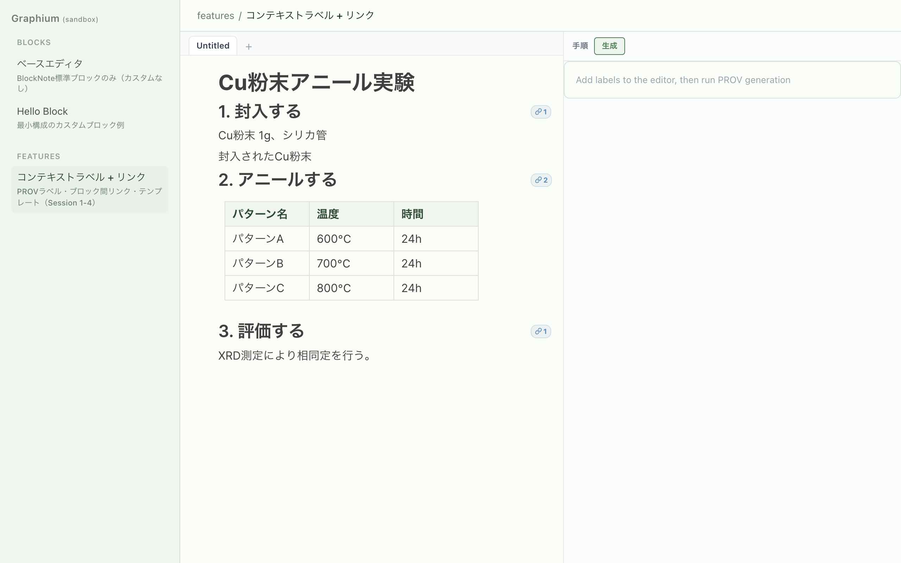
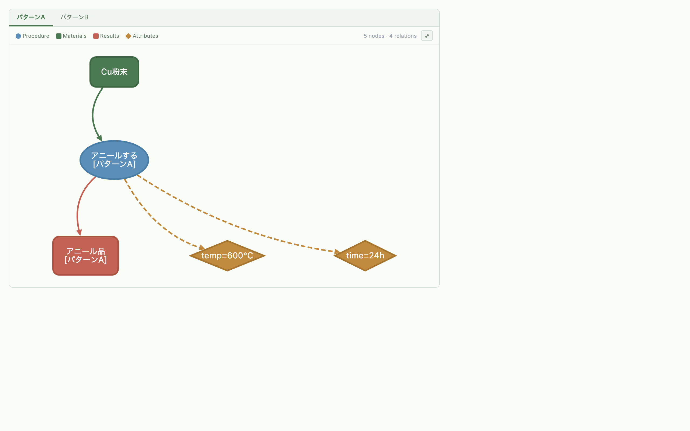
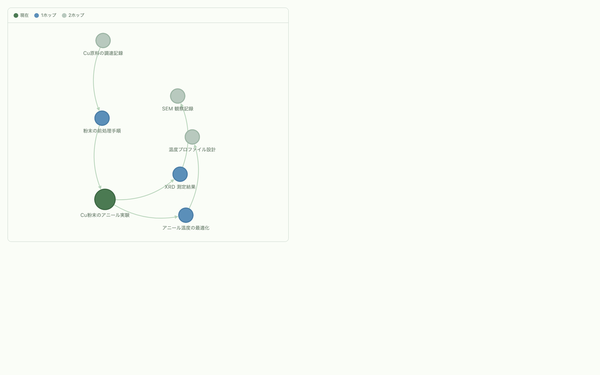
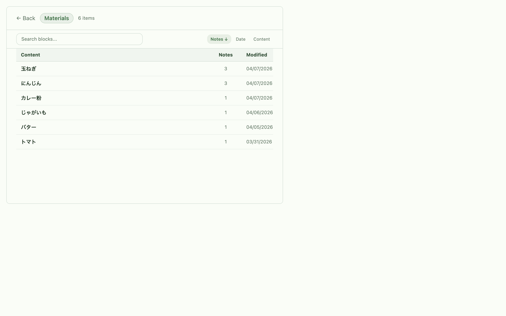
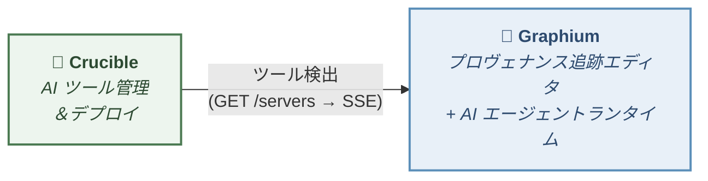

<p align="center">
  
</p>
<h1 align="center">Graphium</h1>
<p align="center">
  <b>PROV-DM</b> プロヴェナンス追跡機能付きブロックエディタ — <a href="https://www.blocknotejs.org/">BlockNote.js</a> ベース
</p>
<p align="center">
  <a href="README.md">English</a> | <b>日本語</b>
</p>

Graphium は、科学ノートのあり方を再考する試みです。小さなアイデアをリンクして思わぬ発見につなげる [Zettelkasten](https://ja.wikipedia.org/wiki/%E3%83%84%E3%82%A7%E3%83%86%E3%83%AB%E3%82%AB%E3%82%B9%E3%83%86%E3%83%B3) スタイルのノート術と、その発見に正式で追跡可能な来歴を与える W3C 標準 [PROV-DM](https://www.w3.org/TR/prov-dm/) を組み合わせています。AI が加わると、AI が生成した知識も人間のノートと同じ来歴で記録されるため、アイデアの出所を常に把握できます。

## 必要な分だけ使う

Graphium は**段階的開示（progressive disclosure）**を設計の中心に据えています。どこまで深く使うかはユーザー次第です：

| レベル | やること | 得られるもの |
|--------|---------|-------------|
| **ノートだけ** | `@` 参照でノートを書いてリンクする | ファイルシステムに保存される Zettelkasten スタイルのリンクノート |
| **一部にラベル** | 重要なブロックに `#` コンテキストラベルを付ける | ラベルを付けた部分に PROV-DM 構造が生まれ、プロヴェナンスグラフが自動生成される |
| **全面ラベリング** | すべてのブロックに体系的にラベルを付ける | ワークフロー全体の完全なプロヴェナンス追跡 |

**ラベルを何も付けなくても** Graphium の価値は得られます。まずはリンクノートから始めて、特定の実験やプロジェクトで追跡性が必要になったら、重要なブロックだけにラベルを付けてください。プロヴェナンス層はラベルを付けた場所だけで有効になります。

このラベル密度のグラデーションは、制限ではなく**コアの設計判断**です。

## すぐに試す

**[→ ブラウザでプレビュー（GitHub Pages）](https://kumagallium.github.io/Graphium/)**

ブラウザ版は **プレビュー** です。エディタの感触と PROV-DM ラベリングをお試しいただけます。ノートはこのブラウザの IndexedDB に保存されるため、お試しには十分ですが、AI 機能（Knowledge Layer・AI チャット）や永続的な保存、複数端末同期がほしい場合はデスクトップアプリか Docker セルフホストをご利用ください。

### デスクトップアプリ

デスクトップアプリをダウンロードすると、ノートはあなたのファイルシステム上に JSON ファイルとして保存されます。保存先を Google Drive / iCloud / Dropbox の同期フォルダに指定すれば、追加の OAuth 連携なしでクラウド同期できます。

| プラットフォーム | ファイル | 確認方法 |
|----------------|---------|---------|
| **macOS** (Apple Silicon — M1/M2/M3/M4) | `Graphium_x.x.x_aarch64.dmg` | Apple メニュー → このMacについて → 「Apple M...」|

**[→ Releases からダウンロード](https://github.com/kumagallium/Graphium/releases/latest)**

> **その他のプラットフォーム**
> デスクトップ版は現在 macOS Apple Silicon 向けのみ提供しています。Windows / Linux / Intel macOS をお使いの場合は、[GitHub Pages のブラウザ版](https://kumagallium.github.io/Graphium/)（インストール不要）をご利用いただくか、下記の [Docker セットアップ](#option-2-run-with-docker--editor-only) でセルフホストしてください。他プラットフォームへの再対応はロードマップに含まれています。テスト協力者を歓迎します ([Issues](https://github.com/kumagallium/Graphium/issues))。

<details>
<summary><b>macOS:「Graphium は壊れています」エラーが出る場合</b></summary>

アプリはまだコード署名されていません。初回起動時に macOS がブロックする場合があります。インストール後にターミナルで以下を実行してください：

```bash
xattr -cr /Applications/Graphium.app
```

その後、通常通りアプリを開けます。

</details>

### モバイル（iPhone / Android）

Graphium はモバイルブラウザ上で **Progressive Web App（PWA）** として動作します。アプリストアからのダウンロードは不要 — ホーム画面に追加するだけで、アプリのように使えます。

#### ホーム画面に追加する（iPhone）

1. Safari で **https://kumagallium.github.io/Graphium/** を開く
2. **共有ボタン**（四角に上矢印のアイコン）をタップ
3. 下にスクロールして **「ホーム画面に追加」** をタップ
4. **「追加」** をタップ — Graphium がアプリアイコンとして表示される

追加後は、ブラウザのナビゲーションバーなしのフルスクリーンモードで起動します。

#### モバイル機能

| 機能 | 説明 |
|------|------|
| **クイックキャプチャ** | ＋ボタンをタップしてメモを即座に記録 |
| **メモ編集** | メモカードをタップして内容を表示・編集 |
| **写真 / 動画 / 音声** | カメラやマイクから直接メディアをキャプチャ |
| **URL ブックマーク** | メタデータ自動プレビュー付きで Web リンクを保存 |
| **メディアプレビュー** | 画像・動画・音声カードをタップして表示・再生 |
| **プルして更新** | タイムラインを下に引っ張って最新データに同期 |

モバイルビューはフィールドでの素早いデータキャプチャに最適化されています。コンテキストラベルやプロヴェナンス機能を含むフル編集は、デスクトップまたはタブレットビューをご利用ください。

<table>
  <tr>
    <td><b>キャプチャタイムライン</b></td>
    <td><b>新規メモ入力</b></td>
  </tr>
  <tr>
    <td></td>
    <td></td>
  </tr>
</table>

## AI ナレッジレイヤー

LLM を接続すると、Graphium はノートの上に**もう一層**を作ります — あなたが書いた内容から自動生成される、概念と要約の Wiki です。*LLM で拡張された Zettelkasten* と捉えてください。AI がノートを読み取り、安定したアイデアを抽出し、相互にリンクし、元のブロックへ引用を張ります — エディタの他の要素と同じ PROV-DM プロヴェナンスを伴って。

| 機能 | 内容 |
|------|------|
| **ノートから Ingest** | ノートを編集すると、AI が知識価値のあるセクションを抽出して Wiki ページ（Concept / Summary）として書き込みます。 |
| **URL・チャットから Ingest** | URL を貼ったり、AI チャットの応答を保存すると、同じプロヴェナンスを持つ Wiki ページに変換されます。 |
| **Synthesis（統合）ページ** | 複数のノートに現れる概念は、それらを接続する Synthesis ページとして自動生成されます。 |
| **自律メンテナンス** | 定期的な Lint、横断更新提案、インデックス再構築により、ノートが増えても Wiki の整合性を保ちます。 |
| **インライン引用** | Wiki の各セクションは元ノートのブロックへ遡れるリンクを持ち、孤立した記述が残りません。 |
| **AI チャット用 Retriever** | AI 応答に Wiki コンテキストが注入されます — アシスタントが先週書いた内容を、毎回ノートを読み直さずに覚えています。 |
| **回答の自動ラベル付け** | AI 回答をエディタに挿入すると、各ブロックに PROV-DM のコンテキストラベル（`[ステップ]`、`[インプット]`、`[アウトプット]` など）が自動で付き、連続する手順は `informed_by` で連結されます。チャットそのものからプロヴェナンスグラフが立ち上がります。 |

Wiki ページはノートと同じストレージ（ブラウザ IndexedDB / Tauri ファイルシステム）に保存され、手動で自由に編集できます。明示的に再生成を指示しない限り、AI が手動編集を上書きすることはありません。Wiki の編集はすべて PROV-DM のリビジョンとして記録されるため、**いつ**生成され、**どのエージェント**（人 or AI）が書き、**どこから**派生したかを常に追跡できます。

AI ナレッジレイヤーは**オプトイン**です。**⚙ 設定 → AI Setup** で LLM を設定すると有効になります。LLM を設定しない場合、Graphium は通常のリンクノートエディタとして動作します。

## Composer（⌘K）

書いたものを探す動作と、次に書くことを尋ねる動作を、ひとつのパレットにまとめました。Graphium のどこからでも `⌘K`（または `Ctrl+K`）で開きます。

| 入力 | 動作 |
|------|------|
| タイトル・見出しの一部 | 該当ノートにジャンプ（Wiki エントリも表示） |
| `#ラベル` | コンテキストラベルでフィルタ — `#procedure` / `#step` / `#手順` はすべて同じものを指す |
| `@作者` | 誰が書いたかでフィルタ — 人間はユーザー名、AI はモデル名 |
| 空 | 直近のノート + *発見カード* — 開いているノートと直近 1 週間の Wiki アクティビティ（ingest / cross-update / regenerate / merge）から導出された即時プロンプト |
| `Cmd+Enter` | 入力をジャンプではなく AI アシスタントに送信 |

エディタ・AI ナレッジレイヤー・あなたの過去の作業を、ひとつの動作で結びつける入り口です。

## テンプレート

`/template` スラッシュコマンドで再利用可能な雛形を呼び出せます。

- **Plan テンプレート** — H1 タイトル、背景 / 目的、インデックステーブル（項目 × 条件）、期待する成果。テーブルの各行はそのまま派生ノートになります
- **Run テンプレート** — 個別記録用の雛形。手順は最初から `[ステップ]` / `[インプット]` / `[ツール]` / `[パラメータ]` / `[アウトプット]` でラベル付けされ、連続する手順は `informed_by` で繋がっています。「ちゃんとラベルが付いたノート」の見本として活用できます

語彙は汎用的で、実験ノート、料理、製造、プロジェクト管理など幅広く使えます。ユーザー定義のテンプレートはプログラム的に登録可能（`registerUserTemplate()`）。

## 読みやすさ

ディスレクシア（識字障害）に配慮した字形のほうが読みやすい人がいます。Graphium には **[Atkinson Hyperlegible Next](https://www.brailleinstitute.org/freefont/)** と **[Lexend](https://www.lexend.com/)** が Inter と並ぶ標準選択肢として組み込まれており、**⚙ 設定 → 一般** から切り替えられます。エディタの他の挙動は変わらないので、自分の目に合うものを選んでください。

## 相互運用性

Graphium はプロヴェナンスを **[PROV-JSON-LD](https://www.w3.org/submissions/2024/SUBM-prov-jsonld-20240825/)** としてエクスポートします。これは Linked Data 上に構築された W3C 標準であり、独自形式ではありません。PROV-DM や JSON-LD を理解するあらゆるツールが Graphium の出力を利用できます。プロヴェナンスデータは設計上ポータブルです。

## 使い方

### 方法 1: オンラインで使う（セットアップ不要）

**https://kumagallium.github.io/Graphium/** にアクセスして書き始めるだけ。ノートはこのブラウザの IndexedDB に保存されます。

> **複数の端末で同じノートを使いたい場合**: [デスクトップアプリ](#デスクトップアプリ)を使い、保存先を Google Drive / iCloud / Dropbox の同期フォルダに指定してください。

### 方法 2: Docker で起動 — エディタのみ

Graphium をスタンドアロンのエディタとして起動します。AI や外部サービスは不要で、ノートエディタだけが動作します。

```bash
git clone https://github.com/kumagallium/Graphium.git
cd Graphium
docker compose -f docker-compose.standalone.yml up -d
```

**http://localhost:5174/Graphium/** を開いて書き始められます。

### 方法 3: Docker で起動 — フルスタック（AI + MCP ツール）

ビルトイン AI バックエンド付きで Graphium を起動し、[Crucible Registry](https://github.com/kumagallium/Crucible) で MCP ツール管理も利用できます。

```bash
git clone https://github.com/kumagallium/Graphium.git
cd Graphium
docker compose up -d
```

| URL | 内容 |
|-----|------|
| http://localhost:5174/Graphium/ | Graphium エディタ（AI セットアップ含む） |

> **上級者向け:** [Crucible Registry UI](http://localhost:8081) で MCP サーバーを管理できます。

#### AI モデルの設定

1. **http://localhost:5174/Graphium/** を開く
2. **⚙ 設定 → AI セットアップ** から LLM モデルと API キーを追加
3. AI アシスタント機能を利用開始

#### MCP ツールの追加（オプション）

1. **http://localhost:8081**（Crucible Registry UI）を開く
2. GitHub リポジトリから MCP サーバーを登録
3. **⚙ 設定 → AI セットアップ** にツールが表示され、有効/無効を切り替え可能

`.env` の編集は不要 — すべてブラウザから設定できます。

> **セルフホスト時のストレージ**
> Docker（または任意の Node.js バックエンド）で動かすと、ノートはサーバーのファイルシステム `/app/data` に保存され、同じ URL に接続するすべてのブラウザ・端末で共有されます。フロントエンドが起動時に自動検知します。
> - **クラウドバックアップ**: `volumes: - "~/Google Drive/Graphium:/app/data"` のように同期フォルダを `/app/data` にマウントすれば、OS が複製を担当します。
> - **リモート VPS**: [rclone](https://rclone.org/) などで `/app/data` を S3 / B2 等にバックアップ。
> - **認証**: `GRAPHIUM_AUTH_TOKEN=<secret>` を設定すると、すべてのストレージリクエストに `X-Graphium-Token` ヘッダーが必要になります。同じ値を **⚙ 設定 → サーバーストレージ** で入力してください。未設定だと URL に到達できる人が誰でも読み書きできます — `localhost` 限定なら問題ありませんが、公開デプロイでは必須です。

> **注意:** Docker モードでは、すべてのサービスが API キー認証なしで動作し、ローカルマシン（`localhost`）からのみアクセス可能です。

#### 最新バージョンへの更新

```bash
./update.sh
```

または手動で：

```bash
git pull                      # 最新の Graphium コードを取得
docker compose pull           # 最新の Crucible イメージを取得
docker compose up -d --build  # Graphium をリビルドして全サービスを再起動
```

### 方法 4: 開発用に起動

```bash
git clone https://github.com/kumagallium/Graphium.git
cd Graphium
pnpm install
pnpm dev --port 5174   # → http://localhost:5174/Graphium/
```

ノートはブラウザの IndexedDB に保存されます。AI 機能を使うにはバックエンドサーバーが必要です。`pnpm dev` でフロントエンドとバックエンドが同時に起動します。**⚙ 設定 → AI セットアップ** から LLM モデルを追加してください。

## 機能一覧

- **コンテキストラベル** — `[ステップ]`、`[インプット]`、`[ツール]`、`[パラメータ]`、`[アウトプット]` を PROV-DM ロールにマッピング
- **ブロック間リンク** — プロヴェナンスセマンティクス付き（`informed_by`、`derived_from`、`used`）
- **マルチページタブエディタ** — スコープ派生対応
- **インデックステーブル** — 関連ノートを表形式で管理、サイドピークプレビュー付き
- **PROV-JSON-LD エクスポート** — W3C 準拠のページ単位プロヴェナンスエクスポート
- **プロヴェナンスグラフ** 可視化（Cytoscape.js + ELK レイアウト）
- **ノート間ネットワークグラフ**（Cytoscape.js + fcose レイアウト）
- **AI アシスタント** — AI 応答からプロヴェナンスメタデータ付きのノートを派生
- **AI 自動ラベル付け** — AI 回答に PROV-DM コンテキストラベルと `informed_by` チェーンが自動で付与される
- **AI ナレッジレイヤー** — 自動生成される Wiki ページ（Concept / Summary / Synthesis）、インライン引用、自律 Lint・横断更新
- **Composer（⌘K）** — ノート検索（`#ラベル` / `@作者` フィルタ）、発見カード、AI への質問を 1 つのパレットに統合
- **テンプレート** — `/template` スラッシュコマンドで Plan / Run の雛形を呼び出せる（拡張可能）
- **読みやすさ設定** — Atkinson Next / Inter / Lexend / デフォルト混合の 4 種を切り替え可能（dyslexia 配慮）
- **ローカルファースト保存** — デスクトップ版はファイルシステム上の JSON、Web 版はブラウザ IndexedDB
- **デスクトップアプリ** — Tauri ベースのネイティブアプリ。保存先を Drive/iCloud/Dropbox 同期フォルダに指定すれば、追加の OAuth なしでクラウド同期できる
- **モバイル PWA** — クイックキャプチャ（メモ、写真、動画、音声、ブックマーク）、プルして更新、メディアプレビュー

### スクリーンショット

<table>
  <tr>
    <td><b>コンテキストラベル付きエディタ & サイドバー</b></td>
    <td><b>プロヴェナンスグラフ（PROV-DM）</b></td>
  </tr>
  <tr>
    <td></td>
    <td></td>
  </tr>
  <tr>
    <td><b>ノート間ネットワークグラフ</b></td>
    <td><b>ラベルギャラリー（インデックステーブル）</b></td>
  </tr>
  <tr>
    <td></td>
    <td></td>
  </tr>
</table>

## PROV-DM 準拠

Graphium は、[W3C PROV Data Model (PROV-DM)](https://www.w3.org/TR/prov-dm/) に準拠した**2層プロヴェナンスモデル**を実装しています。

### 第1層: コンテンツプロヴェナンス — 実験ワークフロー

ドキュメントブロックのコンテキストラベルは PROV-DM 概念にマッピングされます：

| ラベル | PROV-DM 型 | Entity サブタイプ | 説明 |
|-------|-----------|------------------|------|
| `[ステップ]` | `prov:Activity` | — | 実験ステップ |
| `[インプット]` | `prov:Entity` | `material` | プロセスで変換される物質・データ |
| `[ツール]` | `prov:Entity` | `tool` | 装置・器具 |
| `[パラメータ]` | Property | — | 親ノードに埋め込まれる条件・パラメータ |
| `[アウトプット]` | `prov:Entity` | — | Activity から生成される出力 |

関係: `prov:used`（Usage）、`prov:wasGeneratedBy`（Generation）、`prov:wasInformedBy`（前手順リンク経由）

### 第2層: ドキュメントプロヴェナンス — 編集履歴

保存ごとにリビジョンチェーンが PROV-DM として記録されます：

| 概念 | PROV-DM マッピング |
|------|-------------------|
| エディタ（人間または AI） | `prov:Agent` |
| 編集操作 | `prov:Activity`（`startTime` / `endTime` 付き） |
| ドキュメントリビジョン | `prov:Entity`（`prov:generatedAtTime` 付き） |
| エディタ → 編集 | `prov:Association` |
| 編集 → リビジョン | `prov:Generation` |
| リビジョン → 前リビジョン | `prov:Derivation` |

ドキュメントプロヴェナンスはコンテンツプロヴェナンスとは別に `prov:Bundle` としてエクスポートされます。

### PROV-JSON-LD エクスポート

ページ単位のエクスポートは [W3C PROV-JSON-LD 仕様](https://www.w3.org/submissions/2024/SUBM-prov-jsonld-20240825/)に準拠しています：

- [openprovenance コンテキスト](https://openprovenance.org/prov-jsonld/context.jsonld)を使用
- プレフィックスなしの `@type` 値（`Entity`、`Activity`、`Agent`）
- 関係を独立オブジェクトとして表現（`Usage`、`Generation`、`Derivation`、`Association`）
- 標準プロパティ名（`startTime`、`endTime`、`entity`、`activity`、`agent`）

Graphium 固有の拡張は `graphium:` 名前空間（`https://graphium.app/ns#`）を使用します。`graphium:entityType`、`graphium:attributes`、`graphium:editType`、`graphium:summary`、`graphium:contentHash` が含まれます。

## アーキテクチャ

Graphium は **AI バックエンド内蔵のノートエディタ** です。ノートはローカルファイルシステム（デスクトップ版）またはブラウザ IndexedDB（Web 版）に保存されます。AI 機能は Node.js バックエンド（Hono）上で動作する [Vercel AI SDK](https://ai-sdk.dev/) によって提供されます — 外部 AI サーバーは不要です。



| コンポーネント | 技術 |
|--------------|------|
| エディタ | TypeScript / React / BlockNote.js |
| AI ランタイム | Vercel AI SDK / @ai-sdk/mcp |
| バックエンド | Node.js / Hono |
| ストレージ | ローカルファイルシステム（Tauri） / サーバーファイルシステム（Docker） / ブラウザ IndexedDB（Web） |
| グラフ可視化 | Cytoscape.js |
| ビルド | Vite / pnpm |

### Crucible Registry（オプション）

[Crucible Registry](https://github.com/kumagallium/Crucible) は MCP サーバーの管理と自動検出を提供します。接続すると、登録済み MCP ツールが **⚙ 設定 → AI セットアップ** に表示され、AI アシスタントが利用できるようになります。

## エディタの外から書く

Graphium のノートは Graphium 内で書く必要はありません。同梱の [`save-to-graphium`](scripts/claude-code-skill/save-to-graphium/SKILL.md) スキルを使うと、[Claude Code](https://claude.com/claude-code)（CLI または VS Code 拡張）の会話を要約して Graphium のノートとして保存できます。ノートには `agent: "claude-code"`、モデル名、OS ユーザー名が PROV-DM のエージェントメタデータとして記録されるので、AI との議論も手書きノートと同じ来歴の流れに乗ります。

```bash
ln -s "$(pwd)/scripts/claude-code-skill/save-to-graphium" ~/.claude/skills/save-to-graphium
```

シンボリックリンクを張れば、あとは Claude Code に「これを Graphium に保存して」と頼むだけ。次回 Graphium 起動時にサイドバーに現れ、リンクを張ったり、ラベルを付けたり、Knowledge Layer に流し込んだりできます。

## 言語と国際化

Graphium は**英語**（デフォルト）と**日本語**をサポートしています。言語はサイドバーの **⚙ 設定** から切り替えられます。

コンテキストラベル、メニュー、ツールチップ、パネル UI など、すべてのユーザー向けテキストが完全に国際化されています。コンテキストラベルはアクティブなロケールに応じて表示されます（例: 英語では `[Step]`、日本語では `[ステップ]`）。内部データ形式は後方互換性のため安定しています。

| 要素 | 状態 |
|------|------|
| コンテキストラベル | 完全ローカライズ済み（英語 / 日本語） |
| UI テキスト | 完全ローカライズ済み |
| ラベル入力 | 両言語のエイリアスを受け付け（例: `[step]`、`[材料]`） |
| README / ドキュメント | 英語 / 日本語 |

追加言語のコントリビューションを歓迎します。

## 開発

```bash
pnpm install        # 依存関係のインストール
pnpm dev            # フロントエンド + バックエンド開発サーバー
pnpm dev:client     # フロントエンドのみ
pnpm dev:server     # バックエンドのみ
pnpm test           # テスト実行（vitest）
pnpm storybook      # コンポーネントカタログ（http://localhost:6006）
pnpm build          # プロダクションビルド（フロントエンド）
```

## プロジェクト構成

```
src/
├── base/              # エディタコア（BlockNote ラッパー、マルチページ）
├── features/
│   ├── context-label/ # ブロック用 PROV-DM コンテキストラベル
│   ├── block-link/    # ブロック間プロヴェナンスリンク
│   ├── prov-generator/# PROV-JSON-LD 生成 & グラフ可視化
│   ├── prov-export/   # W3C PROV-JSON-LD ファイルエクスポート
│   ├── index-table/   # 関連ノートのインデックステーブル
│   ├── network-graph/ # ノート間派生ネットワーク（Cytoscape + fcose）
│   ├── ai-assistant/  # AI チャット & ノート派生、マーカーによる自動ラベル付け
│   ├── composer/      # ⌘K パレット: ノート検索 + 発見カード + AI 質問
│   ├── template/      # /template スラッシュコマンド（Plan / Run）
│   ├── wiki/          # AI ナレッジレイヤー（Concept / Summary / Synthesis）
│   ├── settings/      # 設定モーダル（一般設定 + AI セットアップ + 読みやすさフォント）
│   └── release-notes/ # リリースノート表示
├── lib/               # ユーティリティ（Google Auth、Drive API、Cytoscape セットアップ）
└── blocks/            # カスタム BlockNote ブロック
```

## ライセンス

[MIT](LICENSE)
