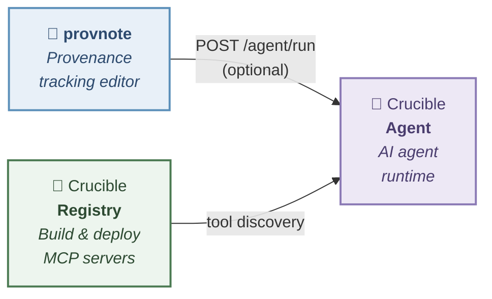

# provnote

Block-based note editor with **PROV-DM** provenance tracking — built on [BlockNote.js](https://www.blocknotejs.org/).

## Try it now

**[→ Open provnote on GitHub Pages](https://kumagallium.github.io/provnote/)**

No installation required — works in your browser. Notes are saved to Google Drive or your browser's local storage.

## What is provnote?

provnote is a **note-taking app** that automatically turns structured notes into traceable provenance graphs.

Every note is a plain block-based document. When you add a **context label** (like `[Procedure]` or `[Result]`) to a block, provnote maps it to a [PROV-DM](https://www.w3.org/TR/prov-dm/) role and builds a provenance graph behind the scenes — no extra effort required.

| Building block | What it does |
|---------------|-------------|
| **BlockNote.js** | A modern block-based rich text editor |
| **Zettelkasten** | Atomic, interlinked note-taking via `@` references |
| **PROV-DM** | W3C standard for provenance — applied via `#` context labels (optional) |
| **AI assistant** | AI-powered note derivation with full provenance metadata (optional) |

### Who is this for?

- **Researchers** who want structured, traceable records with provenance — without leaving a familiar note-taking interface
- **Anyone** who wants a Zettelkasten-style linked note editor with Google Drive sync

PROV-DM labeling is entirely optional. Without labels, provnote works as a standard linked note editor.

## How to use

### Option 1: Use online (no setup)

Visit **https://kumagallium.github.io/provnote/** and start writing. Your notes are saved in your browser's local storage.

To sync with Google Drive, sign in with your Google account from the sidebar.

### Option 2: Run with Docker — editor only

Run provnote as a standalone editor — no AI, no external services. Just the note editor with Google Drive sync.

```bash
git clone https://github.com/kumagallium/provnote.git
cd provnote
docker compose -f docker-compose.standalone.yml up -d
```

Open **http://localhost:5174/provnote/** and start writing.

### Option 3: Run with Docker — full Crucible stack (AI + MCP tools)

Run provnote with the full [Crucible](https://github.com/kumagallium/Crucible) stack: AI chat, note derivation, provenance-tracked AI responses, and MCP tool management.

```bash
git clone https://github.com/kumagallium/provnote.git
cd provnote
docker compose up -d
```

| URL | What it is |
|-----|------------|
| http://localhost:5174/provnote/ | provnote editor |
| http://localhost:8090 | Crucible Agent — AI Chat UI |
| http://localhost:8081 | Crucible Registry — MCP server management |

#### Set up your AI model

1. Open **http://localhost:8090** (Crucible Agent Chat UI)
2. Add your LLM model (e.g., Claude, GPT-4o) with your API key from the UI
3. Go to **http://localhost:5174/provnote/** and start using the AI assistant

#### Add MCP tools (optional)

1. Open **http://localhost:8081** (Crucible Registry UI)
2. Register an MCP server from a GitHub repository
3. The agent automatically discovers and uses registered tools

No `.env` editing required — everything is configured from the browser. Google Drive sync and Google OAuth work out of the box.

> **Note:** In Docker mode, all services run without API key authentication and are only accessible from your local machine (`localhost`).

#### Updating to the latest version

```bash
./update.sh
```

Or manually:

```bash
git pull                      # Get latest provnote code
docker compose pull           # Pull latest Crucible images
docker compose up -d --build  # Rebuild provnote and restart all services
```

### Option 4: Run for development

```bash
git clone https://github.com/kumagallium/provnote.git
cd provnote
pnpm install
pnpm dev --port 5174   # → http://localhost:5174/provnote/
```

Google Drive sync works without any configuration. To enable AI features, you need a separate [crucible-agent](https://github.com/kumagallium/crucible-agent) server. Click the **⚙ Settings** icon in the sidebar to configure the agent URL.

## Features

- **Context labels** — `[Procedure]`, `[Used]`, `[Attribute]`, `[Result]` mapped to PROV-DM roles (`prov:Activity`, `prov:used`, `prov:Entity`, `prov:wasGeneratedBy`)
- **Block-to-block linking** with provenance semantics (`informed_by`, `derived_from`, `used`)
- **Multi-page tabbed editor** with scope derivation
- **Index table** — manage related notes in a tabular view with side-peek preview
- **PROV-JSON-LD generation** from labeled documents
- **Provenance graph** visualization (Cytoscape.js + ELK layout)
- **Inter-note network graph** (Cytoscape.js + fcose layout)
- **AI assistant** — derive notes from AI responses with full provenance metadata
- **Google Drive storage** — notes saved as `.provnote.json` files
- **Google OAuth 2.0** authentication

## Architecture

provnote is a **standalone note editor**. It does not require any backend server to function — notes are stored in Google Drive or the browser's local storage.

AI features are provided by an **optional external agent server**. Any server that implements the `POST /agent/run` endpoint can be used:

| Server | Description |
|--------|-------------|
| [crucible-agent](https://github.com/kumagallium/crucible-agent) | Full-featured agent runtime with MCP tool support and LiteLLM multi-model proxy |
| Any compatible server | Must implement `POST /agent/run` with the same request/response format |

### Crucible ecosystem (optional)

provnote can integrate with the [Crucible](https://github.com/kumagallium/crucible-agent) ecosystem for AI capabilities, but this is entirely optional. The diagram below shows how the components connect when AI features are enabled:



## Language & Internationalization

The provnote UI currently uses **Japanese** for context labels and some interface elements. This reflects the project's origin in a Japanese research group.

| Element | Current language | Planned |
|---------|-----------------|---------|
| Context labels | Japanese (`[手順]`, `[結果]`, …) with English aliases (`[step]`, `[result]`, …) | Full i18n — English default, Japanese secondary |
| UI chrome | Mixed (English + Japanese) | English default |
| README / docs | English (README), Japanese (design specs) | English for all public-facing docs |

Internationalization (i18n) is on the roadmap. Contributions are welcome.

## Development

```bash
pnpm install        # Install dependencies
pnpm dev            # Start dev server
pnpm test           # Run tests (vitest)
pnpm storybook      # Component catalog (http://localhost:6006)
pnpm build          # Production build
```

## Project structure

```
src/
├── base/              # Editor core (BlockNote wrapper, multi-page)
├── features/
│   ├── context-label/ # PROV-DM context labels for blocks
│   ├── block-link/    # Block-to-block provenance links
│   ├── prov-generator/# PROV-JSONLD generation & graph visualization
│   ├── index-table/   # Index table for related notes
│   ├── network-graph/ # Inter-note derivation network (Cytoscape + fcose)
│   ├── ai-assistant/  # AI derivation via agent server
│   ├── settings/      # AI agent URL configuration
│   ├── template/      # Template save/load/diff
│   └── release-notes/ # Release notes display
├── lib/               # Utilities (Google Auth, Drive API, Cytoscape setup)
└── blocks/            # Custom BlockNote blocks
```

## License

[MIT](LICENSE)
