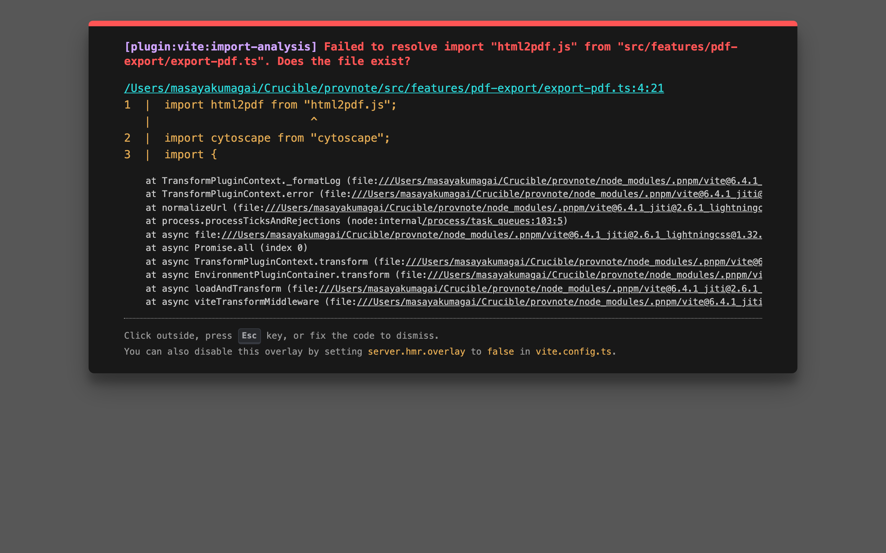
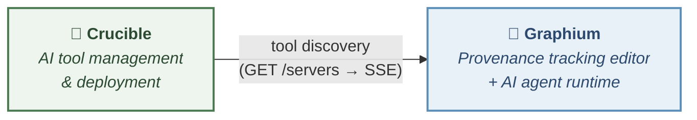

<p align="center">
  
</p>
<h1 align="center">Graphium</h1>
<p align="center">
  Block-based note editor with <b>PROV-DM</b> provenance tracking — built on <a href="https://www.blocknotejs.org/">BlockNote.js</a>.
</p>
<p align="center">
  <b>English</b> | <a href="README.ja.md">日本語</a>
</p>

Graphium is an attempt to rethink how scientific notes work. It combines [Zettelkasten](https://en.wikipedia.org/wiki/Zettelkasten)-style atomic note-taking — where linking small ideas leads to unexpected discoveries — with [PROV-DM](https://www.w3.org/TR/prov-dm/), a W3C standard that gives those discoveries formal, traceable provenance. When AI enters the picture, it bridges both: AI-generated knowledge is recorded with the same provenance trail as human notes, so you always know where an idea came from.

## Use as much — or as little — as you need

Graphium is designed around **progressive disclosure**. You choose how deep to go:

| Level | What you do | What you get |
|-------|------------|--------------|
| **Just notes** | Write and link notes with `@` references | A Zettelkasten-style linked notebook saved on your filesystem |
| **Some labels** | Add `#` context labels to key blocks | Those blocks gain PROV-DM structure — a provenance graph emerges for the labeled parts |
| **Full labeling** | Label all blocks systematically | Complete provenance tracking across your entire workflow |

**You don't need to label anything** to get value from Graphium. Start with plain linked notes. When you want traceability for a specific experiment or project, add labels to just the blocks that matter. The provenance layer activates only where you choose.

This gradient of label density is a core design decision — not a limitation.

## Try it now

**[→ Open Graphium on GitHub Pages](https://kumagallium.github.io/Graphium/)**

No installation required — works in your browser. Notes are saved in this browser (IndexedDB).

### Desktop app

Download the desktop app to save notes as plain JSON files on your filesystem. Point the save folder at a Google Drive / iCloud / Dropbox synced folder if you want cloud sync — no extra OAuth setup needed.

| Platform | File | How to check |
|----------|------|-------------|
| **macOS** (Apple Silicon — M1/M2/M3/M4) | `Graphium_x.x.x_aarch64.dmg` | Apple menu →  About This Mac → "Apple M..." |

**[→ Download from Releases](https://github.com/kumagallium/Graphium/releases/latest)**

> **Other platforms**
> The desktop build currently ships only for macOS Apple Silicon. If you are on Windows, Linux, or Intel macOS, please use the [browser version on GitHub Pages](https://kumagallium.github.io/Graphium/) (no install) or self-host with the [Docker setup](#option-2-run-with-docker--editor-only) described below. Bringing the desktop app back to other platforms is on the roadmap; see [issues](https://github.com/kumagallium/Graphium/issues) if you'd like to help test.

<details>
<summary><b>macOS: "Graphium is damaged" error</b></summary>

The app is not code-signed yet. macOS may block it on first launch. To fix this, run in Terminal after installing:

```bash
xattr -cr /Applications/Graphium.app
```

Then open the app normally.

</details>

### Mobile (iPhone / Android)

Graphium works as a **Progressive Web App (PWA)** on mobile browsers. No app store download needed — just add it to your home screen for an app-like experience.

#### Add to Home Screen (iPhone)

1. Open **https://kumagallium.github.io/Graphium/** in Safari
2. Tap the **Share** button (square with arrow)
3. Scroll down and tap **"Add to Home Screen"**
4. Tap **"Add"** — Graphium appears as an app icon

Once added, Graphium launches in full-screen mode without the browser navigation bar.

#### Mobile features

| Feature | Description |
|---------|-------------|
| **Quick capture** | Tap the + button to jot down memos instantly |
| **Memo editing** | Tap any memo card to view and edit its content |
| **Photo / Video / Audio** | Capture media directly from the camera or microphone |
| **URL bookmarks** | Save web links with automatic metadata preview |
| **Media preview** | Tap image/video/audio cards to view or play them |
| **Pull-to-refresh** | Pull down the timeline to sync latest data |

The mobile view is optimized for quick data capture in the field. For full editing with context labels and provenance features, use the desktop or tablet view.

<table>
  <tr>
    <td><b>Capture timeline</b></td>
    <td><b>New memo input</b></td>
  </tr>
  <tr>
    <td></td>
    <td></td>
  </tr>
</table>

## AI Knowledge Layer

When you connect an LLM, Graphium builds a **second layer** on top of your notes — a wiki of concepts and summaries auto-generated from what you've written. Think of it as *Zettelkasten extended by an LLM*: the AI reads your notes, extracts stable ideas, keeps them cross-linked, and cites back to the source blocks — all while carrying the same PROV-DM provenance as the rest of the editor.

| Capability | What it does |
|-----------|--------------|
| **Ingest from notes** | After you edit a note, the AI extracts knowledge-worthy sections and writes them into Wiki pages (Concept / Summary). |
| **Ingest from URL & chat** | Drop a URL or save an AI chat response — it becomes a Wiki page with the same provenance chain. |
| **Synthesis pages** | Concepts that appear across multiple notes get auto-generated Synthesis pages that connect them. |
| **Autonomous maintenance** | Periodic lint checks, cross-update proposals, and index rebuilds keep the wiki coherent as your notes grow. |
| **Inline citations** | Every Wiki section links back to the source block in the original note, so nothing is orphaned. |
| **Retriever for AI chat** | Wiki context is injected into AI responses — the assistant remembers what you wrote last week without re-reading every note. |
| **Auto-labeled answers** | AI replies inserted into the editor are automatically tagged with PROV-DM context labels (`[Step]`, `[Input]`, `[Output]`, …) and consecutive steps get linked with `informed_by` — a provenance graph emerges from the chat itself, no manual labeling required. |

Wiki pages live in the same storage as your notes (browser IndexedDB or Tauri filesystem) and are fully editable by hand. The AI will not overwrite your manual edits unless you explicitly ask it to rewrite a page. Every Wiki edit is recorded as a PROV-DM revision so you can always see **when** a page was generated, **which agent** (human or AI) wrote it, and **from which source**.

AI Knowledge is **opt-in**: configure an LLM in **⚙ Settings → AI Setup** to activate it. Without an LLM, Graphium works as a plain linked-note editor.

## Composer (⌘K)

A single palette for finding what you've written and asking what's next. Hit `⌘K` (or `Ctrl+K`) anywhere in Graphium and start typing.

| Input | Result |
|-------|--------|
| Words from a title or heading | Jump straight to that note (Wiki entries are surfaced too) |
| `#label` | Filter by context label — `#procedure`, `#step`, `#手順` all map to the same thing |
| `@author` | Filter by who wrote it — humans by username, AI by model name |
| Empty | Recent notes plus *discovery cards* — quick prompts derived from your active note and the last week of Wiki activity (ingest / cross-update / regenerate / merge) |
| `Cmd+Enter` | Send the input to the AI assistant instead of jumping |

The Composer is the entry point that ties the editor, the AI Knowledge Layer, and your own past work into one motion.

## Templates

The `/template` slash command opens a picker with reusable scaffolds:

- **Plan template** — H1 title, Background / Goals, an index table (Item × Conditions), and Expected Outcomes. Each row of the table becomes a child note when you derive it.
- **Run template** — a per-item record where steps are pre-labeled (`[Step]` / `[Input]` / `[Tool]` / `[Parameter]` / `[Output]`) and consecutive steps are pre-linked with `informed_by`. Use it as a working example of "what a fully labeled note looks like."

The vocabulary is generic: it fits lab experiments, cooking, manufacturing runs, or any project workflow. User-defined templates can be registered programmatically (`registerUserTemplate()`).

## Reading comfort

Some people read more comfortably with letterforms designed for dyslexia. Graphium ships with **[Atkinson Hyperlegible Next](https://www.brailleinstitute.org/freefont/)** and **[Lexend](https://www.lexend.com/)** as built-in choices alongside Inter, switchable from **⚙ Settings → General**. Pick what works for your eyes — the rest of the editor stays the same.

## Interoperability

Graphium exports provenance as **[PROV-JSON-LD](https://www.w3.org/submissions/2024/SUBM-prov-jsonld-20240825/)** — a W3C standard built on Linked Data. This is not a proprietary format: any tool that understands PROV-DM or JSON-LD can consume Graphium's output. Provenance data is portable by design.

## How to use

### Option 1: Use online (no setup)

Visit **https://kumagallium.github.io/Graphium/** and start writing. Your notes are saved in your browser's IndexedDB.

> **Want the same notes on multiple machines?** Use the [desktop app](#desktop-app) and point its save folder at a Google Drive / iCloud / Dropbox synced folder.

### Option 2: Run with Docker — editor only

Run Graphium as a standalone editor — no AI, no external services. Just the note editor.

```bash
git clone https://github.com/kumagallium/Graphium.git
cd Graphium
docker compose -f docker-compose.standalone.yml up -d
```

Open **http://localhost:5174/Graphium/** and start writing.

### Option 3: Run with Docker — full stack (AI + MCP tools)

Run Graphium with the built-in AI backend and [Crucible Registry](https://github.com/kumagallium/Crucible) for MCP tool management.

```bash
git clone https://github.com/kumagallium/Graphium.git
cd Graphium
docker compose up -d
```

| URL | What it is |
|-----|------------|
| http://localhost:5174/Graphium/ | Graphium editor (includes AI setup) |

> **Advanced:** [Crucible Registry UI](http://localhost:8081) is available for MCP server management.

#### Set up your AI model

1. Open **http://localhost:5174/Graphium/**
2. Go to **⚙ Settings → AI Setup**, add your LLM model and API key
3. Start using the AI assistant

#### Add MCP tools (optional)

1. Open **http://localhost:8081** (Crucible Registry UI)
2. Register an MCP server from a GitHub repository
3. Tools appear in **⚙ Settings → AI Setup** and can be toggled on/off

No `.env` editing required — everything is configured from the browser.

> **Self-hosting and storage**
> Notes are stored in the browser's IndexedDB by default. To keep notes off the browser:
> - **On a personal machine** running Docker: mount a Google Drive / iCloud / Dropbox synced folder to `/app/data` and the OS handles cloud sync.
> - **On a remote VPS**: use [rclone](https://rclone.org/) or similar to sync `/app/data` ↔ your cloud storage of choice.
> - Server-side filesystem storage (notes saved to `/app/data` and accessible across browsers) is on the roadmap — see [#G-DOCKER-SYNC](ideas.md).

> **Note:** In Docker mode, all services run without API key authentication and are only accessible from your local machine (`localhost`).

#### Updating to the latest version

```bash
./update.sh
```

Or manually:

```bash
git pull                      # Get latest Graphium code
docker compose pull           # Pull latest Crucible images
docker compose up -d --build  # Rebuild Graphium and restart all services
```

### Option 4: Run for development

```bash
git clone https://github.com/kumagallium/Graphium.git
cd Graphium
pnpm install
pnpm dev --port 5174   # → http://localhost:5174/Graphium/
```

Notes are saved to your browser's IndexedDB by default. AI features require the backend server — run `pnpm dev` which starts both the frontend and backend together. Go to **⚙ Settings → AI Setup** to add your LLM model.

## Features

- **Context labels** — `[Step]`, `[Input]`, `[Tool]`, `[Parameter]`, `[Output]` mapped to PROV-DM roles
- **Block-to-block linking** with provenance semantics (`informed_by`, `derived_from`, `used`)
- **Multi-page tabbed editor** with scope derivation
- **Index table** — manage related notes in a tabular view with side-peek preview
- **PROV-JSON-LD export** — W3C compliant per-page provenance export
- **Provenance graph** visualization (Cytoscape.js + ELK layout)
- **Inter-note network graph** (Cytoscape.js + fcose layout)
- **AI assistant** — derive notes from AI responses with full provenance metadata
- **AI auto-labeling** — AI answers are inserted with PROV-DM context labels and `informed_by` chains already attached
- **AI Knowledge Layer** — auto-generated Wiki pages (Concept / Summary / Synthesis) with inline citations, autonomous lint & cross-update
- **Composer (⌘K)** — unified palette for note search (`#label` / `@author` filters), discovery cards, and AI ask
- **Templates** — `/template` slash command with Plan and Run scaffolds (extensible)
- **Reading-font setting** — pick between Atkinson Next, Inter, Lexend, and a default mix; tuned for dyslexia-aware reading
- **Local-first storage** — plain JSON files on your filesystem (desktop) or IndexedDB (browser)
- **Desktop app** — Tauri-based native app with local file storage; point the save folder at a synced cloud folder (Drive/iCloud/Dropbox) for cross-device sync without OAuth
- **Mobile PWA** — Quick capture (memos, photos, video, audio, bookmarks) with pull-to-refresh and media preview

### Screenshots

<table>
  <tr>
    <td><b>Editor with context labels</b></td>
    <td><b>Provenance graph (PROV-DM)</b></td>
  </tr>
  <tr>
    <td></td>
    <td></td>
  </tr>
  <tr>
    <td><b>Document provenance history</b></td>
    <td></td>
  </tr>
  <tr>
    <td></td>
    <td></td>
  </tr>
</table>

## PROV-DM compliance

Graphium implements a **two-layer provenance model**, both conforming to the [W3C PROV Data Model (PROV-DM)](https://www.w3.org/TR/prov-dm/).

### Layer 1: Content Provenance — experimental workflow

Context labels on document blocks are mapped to PROV-DM concepts:

| Label | PROV-DM type | Entity subtype | Description |
|-------|-------------|----------------|-------------|
| `[Step]` | `prov:Activity` | — | Experimental step |
| `[Input]` | `prov:Entity` | `material` | Substance / data transformed in a process |
| `[Tool]` | `prov:Entity` | `tool` | Equipment or instrument |
| `[Parameter]` | Property | — | Parameter / condition embedded in parent node |
| `[Output]` | `prov:Entity` | — | Output generated by an activity |

Relationships: `prov:used` (Usage), `prov:wasGeneratedBy` (Generation), `prov:wasInformedBy` (via prior-step links).

### Layer 2: Document Provenance — edit history

Every save creates a revision chain tracked as PROV-DM:

| Concept | PROV-DM mapping |
|---------|----------------|
| Editor (human or AI) | `prov:Agent` |
| Edit operation | `prov:Activity` with `startTime` / `endTime` |
| Document revision | `prov:Entity` with `prov:generatedAtTime` |
| Editor → edit | `prov:Association` |
| Edit → revision | `prov:Generation` |
| Revision → previous | `prov:Derivation` |

Document provenance is exported as a `prov:Bundle`, separate from content provenance.

### PROV-JSON-LD export

The per-page export conforms to the [W3C PROV-JSON-LD specification](https://www.w3.org/submissions/2024/SUBM-prov-jsonld-20240825/):

- Uses the [openprovenance context](https://openprovenance.org/prov-jsonld/context.jsonld)
- Unprefixed `@type` values (`Entity`, `Activity`, `Agent`)
- Relationships as separate objects (`Usage`, `Generation`, `Derivation`, `Association`)
- Standard property names (`startTime`, `endTime`, `entity`, `activity`, `agent`)

Graphium-specific extensions use the `graphium:` namespace (`https://graphium.app/ns#`), including `graphium:entityType`, `graphium:attributes`, `graphium:editType`, `graphium:summary`, and `graphium:contentHash`.

## Architecture

Graphium is a **note editor with a built-in AI backend**. Notes are stored on your local filesystem (desktop app) or in the browser's IndexedDB (web). AI features are powered by [Vercel AI SDK](https://ai-sdk.dev/) running on a Node.js backend (Hono) — no external AI server required.



| Component | Technology |
|-----------|------------|
| Editor | TypeScript / React / BlockNote.js |
| AI Runtime | Vercel AI SDK / @ai-sdk/mcp |
| Backend | Node.js / Hono |
| Storage | Browser IndexedDB / Local filesystem (Tauri) |
| Desktop | Tauri v2 (macOS / Windows / Linux) |
| Graph Visualization | Cytoscape.js |
| Build | Vite / pnpm |

### Crucible Registry (optional)

[Crucible Registry](https://github.com/kumagallium/Crucible) provides MCP server management with auto-discovery. When connected, registered MCP tools appear in **⚙ Settings → AI Setup** and can be used by the AI assistant.

## Beyond the editor

Graphium notes don't have to be written inside Graphium. The bundled [`save-to-graphium`](scripts/claude-code-skill/save-to-graphium/SKILL.md) skill lets [Claude Code](https://claude.com/claude-code) (CLI or VS Code extension) save the gist of any conversation as a Graphium note. The note carries `agent: "claude-code"`, the model name, and the OS user as PROV-DM agent metadata, so AI-driven discussions get the same provenance trail as anything you wrote by hand.

```bash
ln -s "$(pwd)/scripts/claude-code-skill/save-to-graphium" ~/.claude/skills/save-to-graphium
```

After the symlink is in place, just ask Claude Code "save this to Graphium" — the note appears in your sidebar on next launch, ready to be linked, labeled, or pushed into the Knowledge Layer.

## Language & Internationalization

Graphium supports **English** (default) and **Japanese**. The language can be switched from **⚙ Settings** in the sidebar.

All user-facing text — context labels, menus, tooltips, and panel UI — is fully internationalized. Context labels are displayed in the active locale (e.g. `[Step]` in English, `[ステップ]` in Japanese) while the internal data format remains stable for backward compatibility.

| Element | Status |
|---------|--------|
| Context labels | Fully localized (English / Japanese) |
| UI chrome | Fully localized |
| Label input | Both languages accepted as aliases (e.g. `[step]`, `[材料]`) |
| README / docs | English / Japanese |

Contributions for additional languages are welcome.

## Development

```bash
pnpm install        # Install dependencies
pnpm dev            # Start frontend + backend dev server
pnpm dev:client     # Start frontend only
pnpm dev:server     # Start backend only
pnpm test           # Run tests (vitest)
pnpm storybook      # Component catalog (http://localhost:6006)
pnpm build          # Production build (frontend)
```

## Project structure

```
src/
├── base/              # Editor core (BlockNote wrapper, multi-page)
├── features/
│   ├── context-label/ # PROV-DM context labels for blocks
│   ├── block-link/    # Block-to-block provenance links
│   ├── prov-generator/# PROV-JSON-LD generation & graph visualization
│   ├── prov-export/   # W3C PROV-JSON-LD file export
│   ├── index-table/   # Index table for related notes
│   ├── network-graph/ # Inter-note derivation network (Cytoscape + fcose)
│   ├── ai-assistant/  # AI chat & note derivation, marker-based auto-labeling
│   ├── composer/      # ⌘K palette: note search + discovery cards + AI ask
│   ├── template/      # /template slash command (Plan / Run)
│   ├── wiki/          # AI Knowledge Layer (Concept / Summary / Synthesis)
│   ├── settings/      # Settings modal (General + AI Setup + reading font)
│   └── release-notes/ # Release notes display
├── server/            # Built-in AI backend (Hono + Vercel AI SDK)
│   ├── routes/        # API endpoints (/api/agent, /api/models, etc.)
│   ├── services/      # LLM, MCP, Registry, agent loop
│   └── config/        # Model & profile persistence (JSON files)
├── lib/               # Utilities (Google Auth, Drive API, Cytoscape setup)
└── blocks/            # Custom BlockNote blocks
```

## License

[MIT](LICENSE)
