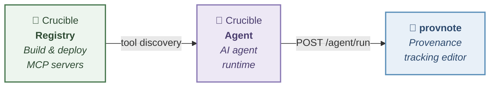

# provnote

Block-based note editor with **PROV-DM** provenance tracking — built on [BlockNote.js](https://www.blocknotejs.org/).

## Try it now

**[→ Open provnote on GitHub Pages](https://kumagallium.github.io/provnote/)**

No installation required — works in your browser. Notes are saved to Google Drive or your browser's local storage.

## What is provnote?

provnote turns structured notes into traceable provenance graphs. It combines:

- **BlockNote.js** — a modern block-based rich text editor
- **Zettelkasten** — atomic, linked note-taking
- **PROV-DM** — W3C standard for provenance data model
- **AI-powered** — AI assistant integration with full provenance tracking

## How to use

### Option 1: Use online (no setup)

Visit **https://kumagallium.github.io/provnote/** and start writing. Your notes are saved in your browser's local storage.

To sync with Google Drive, sign in with your Google account from the sidebar.

### Option 2: Run with Docker (recommended for local use)

Run provnote with AI assistant — no Node.js or Python required. Just Docker.

```bash
git clone https://github.com/kumagallium/provnote.git
cd provnote
docker compose up -d
```

| URL | What it is |
|-----|------------|
| http://localhost:5174/provnote/ | provnote editor |
| http://localhost:8090 | Crucible Agent Chat UI |

#### Set up your AI model

1. Open **http://localhost:8090** (Crucible Agent Chat UI)
2. Add your LLM model (e.g., Claude, GPT-4o) with your API key from the UI
3. Go to **http://localhost:5174/provnote/** and start using the AI assistant

No `.env` editing required — everything is configured from the browser. Google Drive sync and Google OAuth work out of the box.

> **Note:** In Docker mode, the agent server runs without API key authentication. provnote connects to it directly at `http://localhost:8090` — no API key is needed in the Settings screen. This is safe because the agent is only accessible from your local machine.

#### Updating to the latest version

```bash
git pull
docker compose up -d --build
```

The `--build` flag rebuilds images with the latest code changes.

### Option 3: Run for development

```bash
git clone https://github.com/kumagallium/provnote.git
cd provnote
pnpm install
pnpm dev --port 5174   # → http://localhost:5174/provnote/
```

Google Drive sync works without any configuration. To enable AI features, you need a separate [crucible-agent](https://github.com/kumagallium/crucible-agent) server. Click the **⚙ Settings** icon in the sidebar to configure the agent URL.

## Features

- Context labels (`[手順]`, `[使用したもの]`, `[属性]`, `[試料]`, `[結果]`) mapped to PROV-DM roles
- Block-to-block linking with provenance semantics (`informed_by`, `derived_from`, `used`)
- Multi-page tabbed editor with scope derivation
- Sample branching (table rows → parallel PROV activities)
- PROV-JSONLD generation from labeled documents
- Provenance graph visualization (Cytoscape.js + ELK layout)
- Inter-note network graph (Cytoscape.js + fcose layout)
- AI assistant — derive notes from AI responses with full provenance metadata
- Google Drive storage — notes saved as `.provnote.json` files
- Google OAuth 2.0 authentication

## Architecture & AI integration



provnote sends requests to an external agent server. Any server that implements the `POST /agent/run` endpoint can be used:

| Server | Description |
|--------|-------------|
| [crucible-agent](https://github.com/kumagallium/crucible-agent) | Full-featured agent runtime with MCP tool support and LiteLLM multi-model proxy |
| Any OpenAI-compatible proxy | Must implement `POST /agent/run` with the same request/response format |

## Development

```bash
pnpm install        # Install dependencies
pnpm dev            # Start dev server
pnpm test           # Run tests (vitest)
pnpm storybook      # Component catalog (http://localhost:6006)
pnpm build          # Production build
```

## Project structure

```
src/
├── base/              # Editor core (BlockNote wrapper, multi-page)
├── features/
│   ├── context-label/ # PROV-DM context labels for blocks
│   ├── block-link/    # Block-to-block provenance links
│   ├── prov-generator/# PROV-JSONLD generation & graph visualization
│   ├── sample-branch/ # Sample table → activity branching
│   ├── network-graph/ # Inter-note derivation network (Cytoscape + fcose)
│   ├── ai-assistant/  # AI derivation via agent server
│   ├── settings/      # AI agent URL configuration
│   ├── template/      # Template save/load/diff
│   └── release-notes/ # Release notes display
├── lib/               # Utilities (Google Auth, Drive API, Cytoscape setup)
└── blocks/            # Custom BlockNote blocks
```

## License

[MIT](LICENSE)
