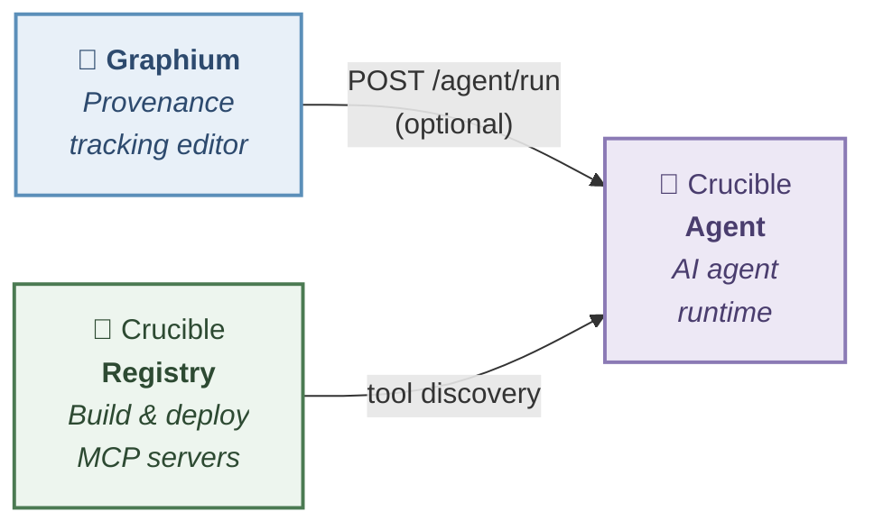

<p align="center">
  
</p>
<h1 align="center">Graphium</h1>
<p align="center">
  Block-based note editor with <b>PROV-DM</b> provenance tracking — built on <a href="https://www.blocknotejs.org/">BlockNote.js</a>.
</p>
<p align="center">
  <b>English</b> | <a href="README.ja.md">日本語</a>
</p>

Graphium is an attempt to rethink how scientific notes work. It combines [Zettelkasten](https://en.wikipedia.org/wiki/Zettelkasten)-style atomic note-taking — where linking small ideas leads to unexpected discoveries — with [PROV-DM](https://www.w3.org/TR/prov-dm/), a W3C standard that gives those discoveries formal, traceable provenance. When AI enters the picture, it bridges both: AI-generated knowledge is recorded with the same provenance trail as human notes, so you always know where an idea came from.

## Use as much — or as little — as you need

Graphium is designed around **progressive disclosure**. You choose how deep to go:

| Level | What you do | What you get |
|-------|------------|--------------|
| **Just notes** | Write and link notes with `@` references | A Zettelkasten-style linked notebook with Google Drive sync |
| **Some labels** | Add `#` context labels to key blocks | Those blocks gain PROV-DM structure — a provenance graph emerges for the labeled parts |
| **Full labeling** | Label all blocks systematically | Complete provenance tracking across your entire workflow |

**You don't need to label anything** to get value from Graphium. Start with plain linked notes. When you want traceability for a specific experiment or project, add labels to just the blocks that matter. The provenance layer activates only where you choose.

This gradient of label density is a core design decision — not a limitation.

## Try it now

**[→ Open Graphium on GitHub Pages](https://kumagallium.github.io/Graphium/)**

No installation required — works in your browser. Notes are saved to Google Drive or your browser's local storage.

## Interoperability

Graphium exports provenance as **[PROV-JSON-LD](https://www.w3.org/submissions/2024/SUBM-prov-jsonld-20240825/)** — a W3C standard built on Linked Data. This is not a proprietary format: any tool that understands PROV-DM or JSON-LD can consume Graphium's output. Provenance data is portable by design.

## How to use

### Option 1: Use online (no setup)

Visit **https://kumagallium.github.io/Graphium/** and start writing. Your notes are saved in your browser's local storage.

To sync with Google Drive, sign in with your Google account from the sidebar.

### Option 2: Run with Docker — editor only

Run Graphium as a standalone editor — no AI, no external services. Just the note editor with Google Drive sync.

```bash
git clone https://github.com/kumagallium/Graphium.git
cd Graphium
docker compose -f docker-compose.standalone.yml up -d
```

Open **http://localhost:5174/Graphium/** and start writing.

### Option 3: Run with Docker — full Crucible stack (AI + MCP tools)

Run Graphium with the full [Crucible](https://github.com/kumagallium/Crucible) stack: AI chat, note derivation, provenance-tracked AI responses, and MCP tool management.

```bash
git clone https://github.com/kumagallium/Graphium.git
cd Graphium
docker compose up -d
```

| URL | What it is |
|-----|------------|
| http://localhost:5174/Graphium/ | Graphium editor |
| http://localhost:8090 | Crucible Agent — AI Chat UI |
| http://localhost:8081 | Crucible Registry — MCP server management |

#### Set up your AI model

1. Open **http://localhost:8090** (Crucible Agent Chat UI)
2. Add your LLM model (e.g., Claude, GPT-4o) with your API key from the UI
3. Go to **http://localhost:5174/Graphium/** and start using the AI assistant

#### Add MCP tools (optional)

1. Open **http://localhost:8081** (Crucible Registry UI)
2. Register an MCP server from a GitHub repository
3. The agent automatically discovers and uses registered tools

No `.env` editing required — everything is configured from the browser. Google Drive sync and Google OAuth work out of the box.

> **Note:** In Docker mode, all services run without API key authentication and are only accessible from your local machine (`localhost`).

#### Updating to the latest version

```bash
./update.sh
```

Or manually:

```bash
git pull                      # Get latest Graphium code
docker compose pull           # Pull latest Crucible images
docker compose up -d --build  # Rebuild Graphium and restart all services
```

### Option 4: Run for development

```bash
git clone https://github.com/kumagallium/Graphium.git
cd Graphium
pnpm install
pnpm dev --port 5174   # → http://localhost:5174/Graphium/
```

Google Drive sync works without any configuration. To enable AI features, you need a separate [Crucible Agent](https://github.com/kumagallium/Crucible-Agent) server. Click the **⚙ Settings** icon in the sidebar to configure the agent URL.

## Features

- **Context labels** — `[Procedure]`, `[Material]`, `[Tool]`, `[Attribute]`, `[Result]` mapped to PROV-DM roles
- **Block-to-block linking** with provenance semantics (`informed_by`, `derived_from`, `used`)
- **Multi-page tabbed editor** with scope derivation
- **Index table** — manage related notes in a tabular view with side-peek preview
- **PROV-JSON-LD export** — W3C compliant per-page provenance export
- **Provenance graph** visualization (Cytoscape.js + ELK layout)
- **Inter-note network graph** (Cytoscape.js + fcose layout)
- **AI assistant** — derive notes from AI responses with full provenance metadata
- **Google Drive storage** — notes saved as `.provnote.json` files
- **Google OAuth 2.0** authentication

### Screenshots

<table>
  <tr>
    <td><b>Editor with context labels & sidebar</b></td>
    <td><b>Provenance graph (PROV-DM)</b></td>
  </tr>
  <tr>
    <td></td>
    <td></td>
  </tr>
  <tr>
    <td><b>Inter-note network graph</b></td>
    <td><b>Label gallery (index table)</b></td>
  </tr>
  <tr>
    <td></td>
    <td></td>
  </tr>
</table>

## PROV-DM compliance

Graphium implements a **two-layer provenance model**, both conforming to the [W3C PROV Data Model (PROV-DM)](https://www.w3.org/TR/prov-dm/).

### Layer 1: Content Provenance — experimental workflow

Context labels on document blocks are mapped to PROV-DM concepts:

| Label | PROV-DM type | Entity subtype | Description |
|-------|-------------|----------------|-------------|
| `[Procedure]` | `prov:Activity` | — | Experimental step |
| `[Material]` | `prov:Entity` | `material` | Substance transformed in a process |
| `[Tool]` | `prov:Entity` | `tool` | Equipment or instrument |
| `[Attribute]` | Property | — | Parameter embedded in parent node |
| `[Result]` | `prov:Entity` | — | Output generated by an activity |

Relationships: `prov:used` (Usage), `prov:wasGeneratedBy` (Generation), `prov:wasInformedBy` (via prior-step links).

### Layer 2: Document Provenance — edit history

Every save creates a revision chain tracked as PROV-DM:

| Concept | PROV-DM mapping |
|---------|----------------|
| Editor (human or AI) | `prov:Agent` |
| Edit operation | `prov:Activity` with `startTime` / `endTime` |
| Document revision | `prov:Entity` with `prov:generatedAtTime` |
| Editor → edit | `prov:Association` |
| Edit → revision | `prov:Generation` |
| Revision → previous | `prov:Derivation` |

Document provenance is exported as a `prov:Bundle`, separate from content provenance.

### PROV-JSON-LD export

The per-page export conforms to the [W3C PROV-JSON-LD specification](https://www.w3.org/submissions/2024/SUBM-prov-jsonld-20240825/):

- Uses the [openprovenance context](https://openprovenance.org/prov-jsonld/context.jsonld)
- Unprefixed `@type` values (`Entity`, `Activity`, `Agent`)
- Relationships as separate objects (`Usage`, `Generation`, `Derivation`, `Association`)
- Standard property names (`startTime`, `endTime`, `entity`, `activity`, `agent`)

Graphium-specific extensions use the `provnote:` namespace (`https://provnote.app/ns#`), including `provnote:entityType`, `provnote:attributes`, `provnote:editType`, `provnote:summary`, and `provnote:contentHash`.

## Architecture

Graphium is a **standalone note editor**. It does not require any backend server to function — notes are stored in Google Drive or the browser's local storage.

AI features are provided by an **optional external agent server**. Any server that implements the `POST /agent/run` endpoint can be used:

| Server | Description |
|--------|-------------|
| [Crucible Agent](https://github.com/kumagallium/Crucible-Agent) | Full-featured agent runtime with MCP tool support and LiteLLM multi-model proxy |
| Any compatible server | Must implement `POST /agent/run` with the same request/response format |

### Crucible ecosystem (optional)

Graphium can integrate with the [Crucible](https://github.com/kumagallium/Crucible-Agent) ecosystem for AI capabilities, but this is entirely optional. The diagram below shows how the components connect when AI features are enabled:



## Language & Internationalization

Graphium supports **English** (default) and **Japanese**. The language can be switched from **⚙ Settings** in the sidebar.

All user-facing text — context labels, menus, tooltips, and panel UI — is fully internationalized. Context labels are displayed in the active locale (e.g. `[Procedure]` in English, `[手順]` in Japanese) while the internal data format remains stable for backward compatibility.

| Element | Status |
|---------|--------|
| Context labels | Fully localized (English / Japanese) |
| UI chrome | Fully localized |
| Label input | Both languages accepted as aliases (e.g. `[step]`, `[材料]`) |
| README / docs | English / Japanese |

Contributions for additional languages are welcome.

## Development

```bash
pnpm install        # Install dependencies
pnpm dev            # Start dev server
pnpm test           # Run tests (vitest)
pnpm storybook      # Component catalog (http://localhost:6006)
pnpm build          # Production build
```

## Project structure

```
src/
├── base/              # Editor core (BlockNote wrapper, multi-page)
├── features/
│   ├── context-label/ # PROV-DM context labels for blocks
│   ├── block-link/    # Block-to-block provenance links
│   ├── prov-generator/# PROV-JSON-LD generation & graph visualization
│   ├── prov-export/   # W3C PROV-JSON-LD file export
│   ├── index-table/   # Index table for related notes
│   ├── network-graph/ # Inter-note derivation network (Cytoscape + fcose)
│   ├── ai-assistant/  # AI derivation via agent server
│   ├── settings/      # AI agent URL configuration
│   ├── template/      # Template save/load/diff
│   └── release-notes/ # Release notes display
├── lib/               # Utilities (Google Auth, Drive API, Cytoscape setup)
└── blocks/            # Custom BlockNote blocks
```

## License

[MIT](LICENSE)
