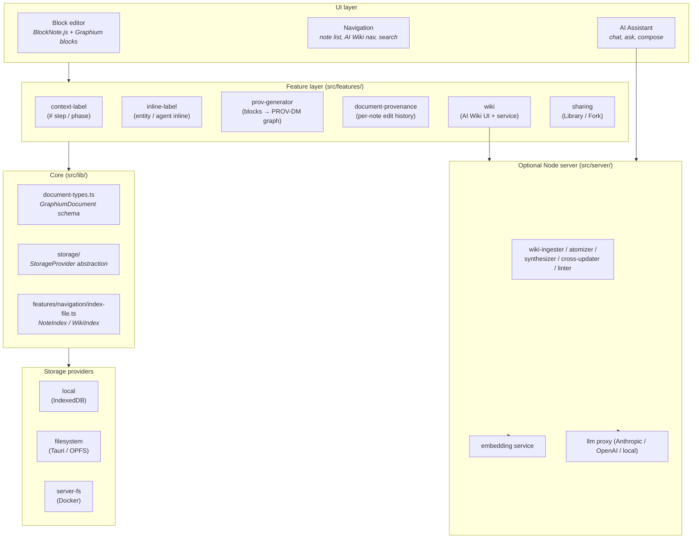
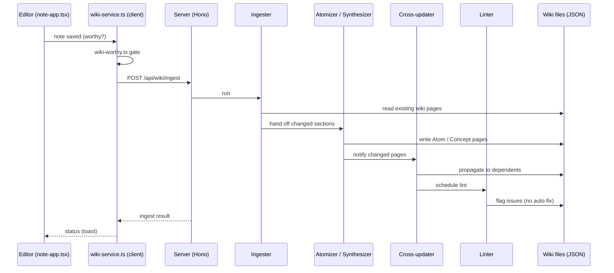
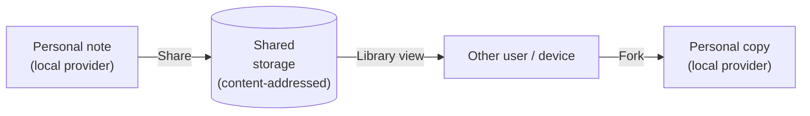

# Graphium — Architecture

This document maps the moving parts: how the editor, the provenance layer,
the AI Knowledge Layer, and the storage layer fit together, and where to
find each of them in the source tree. It is written for contributors and
for anyone who wants to know the shape of the system before reading code.

For the *why*, see [CONCEPT.md](./CONCEPT.md).
For the on-disk file formats, see [DATA_MODEL.md](./DATA_MODEL.md).

---

## 1. At a glance

Graphium is a TypeScript single-page app built on top of
[BlockNote.js](https://www.blocknotejs.org/), shipped as three
distributions that share the same source tree:

- **Web (PWA).** Runs entirely in the browser. Notes live in IndexedDB.
- **Desktop (Tauri v2).** Wraps the web app with a Rust shell so notes
  live as JSON files on the user's filesystem.
- **Self-hosted (Docker).** Runs the same web app plus a Node.js
  companion server that handles AI features (LLM proxy, embedding,
  ingest pipeline).

The companion server (`src/server/`) is built on
[Hono](https://hono.dev/) — a small, web-standard request/response
framework. Hono was chosen over Express because the same app can be
served from `@hono/node-server` (Tauri sidecar / Docker) or, in
principle, from edge runtimes; it is also lighter and better-typed. An
adapter for Vercel Serverless exists in the code (`api/[[...route]].ts`)
but Vercel is not an actively maintained deploy target today.

The server is required for the Knowledge Layer (ingest, embed, chat) and
optional for the editor itself; the editor works without it.

## 2. Layered view

Reading top to bottom: UI talks to feature modules, which read and write
through `src/lib/document-types.ts` and the `StorageProvider` abstraction.
AI features (Wiki ingest, chat) talk to the Node server. The Node server
talks to LLM and embedding backends.

## 3. The four layers in detail

### 3.1 Editor layer (BlockNote + Graphium blocks)

- BlockNote.js gives Graphium its block model, slash menu, and rich-text
  rendering.
- Custom blocks live under `src/blocks/` (today: `bookmark`,
  `example-hello`, `pdf-viewer`). Inline content (entity / agent
  highlights) lives under `src/features/inline-label/`.
- Editor configuration is composed in `src/note-app.tsx`.

### 3.2 Provenance layer (PROV-DM)

Two distinct concerns share the word *provenance* in this codebase. They
are kept separate on purpose:

| Subsystem | Concern | Lives in |
|---|---|---|
| **World provenance** (`prov-generator`) | Provenance of *the things the note describes* — experiments, sources, decisions. Output: a PROV-DM graph. | `src/features/prov-generator/` |
| **Document provenance** (`document-provenance`) | Provenance of *the note itself* — who edited what, when, with which agent (*human* / *ai*). Output: an edit log. | `src/features/document-provenance/` |

If you read code that mentions "provenance," check which of these two is
meant. There is no shared abstraction between them today.

#### Labels feeding the world-provenance graph

Labels come in two passes that operate on the same blocks:

1. **Block-level (`#` context labels).** Tags a heading block as `[Step]`
   (PROV-DM *Activity*; internal key `procedure`) or as a phase
   `[Plan]` / `[Result]` (internal keys `plan` / `result`). Implemented
   in `src/features/context-label/`.
2. **Inline labels.** Highlights spans inside block text as `[Input]` /
   `[Tool]` / `[Parameter]` / `[Output]` (internal keys `material` /
   `tool` / `attribute` / `output`). The first three feed PROV-DM
   *Entity* nodes (with `material` / `tool` subtypes); `[Parameter]`
   becomes a *Property* on the parent Activity or Entity. Implemented in
   `src/features/inline-label/`.

The two passes are independent: a note can have only block-level labels,
only inline labels, both, or neither. The PROV generator merges both
sources when building the graph.

The generator (`src/features/prov-generator/generator.ts`) uses a
`scopeStack` that infers *Activity* containment from heading structure,
so users do not have to nest blocks manually.

### 3.3 Knowledge layer (AI Wiki)

The Wiki is a set of editable JSON documents that an LLM keeps in sync
with your notes. Each Wiki document is a real `GraphiumDocument` with
`source: "ai"` set, so it opens in the same editor.

The pipeline (running on the Node server) has five stages:

| Stage | File | What it does |
|---|---|---|
| **Ingester** | `src/server/services/wiki-ingester.ts` | Reads new / changed notes, decides which Wiki pages to touch |
| **Atomizer** | `src/server/services/wiki-atomizer.ts` | Strips context, produces *Atom* claims with citations back to source notes |
| **Synthesizer** | `src/server/services/wiki-synthesizer.ts` | Weaves Atoms across notes into *Synthesis* pages |
| **Cross-updater** | `src/server/services/wiki-cross-updater.ts` | When one Wiki page changes, propagates to dependent pages |
| **Linter** | `src/server/services/wiki-linter.ts` | Detects orphan Atoms, broken citations, redundant Concepts |

Trigger flow (client-pushed, not server-polled):

Notes:

- **Trigger:** the client pushes a save event into `wiki-service.ingestNote()`,
  which posts to the server. There is no server-side file watcher.
- **Worthiness gate:** `src/features/wiki/wiki-worthy.ts` decides whether a
  note is ingest-worthy at all (e.g., empty drafts are skipped).
- **Failure handling:** retries are not centralized today. Each stage
  surfaces its own errors back through the response.
- **Embeddings** (per Wiki section) are stored via
  `src/lib/embedding-store.ts` and used as the retrieval substrate for AI
  chat. The retriever is `src/features/wiki/retriever.ts`.

The relationship between Notes, Concept, Atom, and Synthesis is described
philosophically in [CONCEPT.md §5](./CONCEPT.md#5-the-hourglass-where-portable-knowledge-is-born).

### 3.4 Storage layer

A single interface (`src/lib/storage/types.ts`) abstracts where notes
live. Three providers ship today:

| Provider | Where notes live | Used in |
|---|---|---|
| **`local`** | Browser IndexedDB | Web (PWA) |
| **`filesystem`** | OPFS (browser) or native FS via Tauri | Desktop |
| **`server-fs`** | Filesystem on the Node server | Self-hosted (Docker) |

The provider is selected at runtime by `src/lib/storage/registry.ts` and
exposed via the `useStorage()` React hook.

A separate **shared storage** subsystem (`src/lib/storage/shared/`)
handles content addressed by hash for the Library / Fork features
(see §5).

## 4. Distribution targets

The same `src/` tree is built three different ways.

### 4.1 Web (PWA)

- Entry: `index.html` → `src/main.tsx`
- Storage: `local` provider (IndexedDB)
- AI features: optional, point at any reachable server URL
- Hosting: GitHub Pages today, Docker self-host for richer setups

### 4.2 Desktop (Tauri v2)

- Entry: `src-tauri/src/lib.rs` boots a webview that loads the same `src/`
  bundle
- Storage: `filesystem` provider, default path `~/Documents/Graphium/`
- Tauri commands (`list_note_files`, etc.) are defined in `lib.rs` and
  matched by TypeScript wrappers
- Currently shipped only for macOS Apple Silicon (see `feedback_*` in
  CLAUDE.md / memory)

### 4.3 Self-hosted (Docker)

- Entry: `docker-compose.yml` (or `docker-compose.standalone.yml` for the
  editor-only flavor)
- Server: `src/server/index.ts`, a Hono app on `@hono/node-server`
- Storage: `server-fs` provider; notes live on the host filesystem
- AI: ships with LLM and embedding endpoints wired up

## 5. Sharing and Library

Graphium has an opt-in sharing model that does **not** require a central
service. It is built on top of a content-addressed shared storage layer.

Key pieces:

- **`src/features/sharing/`** — Library view, Share / Unshare actions, Fork
- **`src/lib/storage/shared/`** — content-addressed blob layer (hashing in
  `hash.ts`, ID assignment in `id.ts`, local-folder backend in
  `local-folder.ts`)
- **Blob materialization** — when sharing a note that embeds media, the
  media is uploaded as `shared-blob:` references; on Fork, those blobs are
  re-materialized into the personal copy

Today the shared backend is a local folder. Other backends (cloud
buckets, S3, IPFS-style) can be added by implementing the same blob
interface.

## 6. The Node server (when present)

The server is built on [Hono](https://hono.dev/) and is intentionally
thin. It does three jobs:

1. **Run the Wiki pipeline** (`src/server/services/wiki-*`).
2. **Proxy LLM and embedding calls** so API keys never reach the browser.
   See `src/server/services/llm.ts`, `embedding.ts`.
3. **Expose REST endpoints** under `src/server/routes/` (`agent`, `wiki`,
   `prov`, `tools`, `models`, `profiles`, `storage`, `health`).

When running as PWA only, all of this is absent and the editor still
works.

### 6.1 Authentication and trust model (current state)

Today the server's trust model is **deliberately minimal**. The expected
deployment is one of:

- The Tauri sidecar — server talks only to `tauri://localhost` origins
  (CORS-enforced) and lives in the user's process tree.
- A self-hosted Docker behind the user's own boundary (VPN, LAN, or
  reverse proxy).

Tokens you may see in headers (`X-Graphium-Token`, `X-LLM-API-Key`,
`X-Registry-URL`) are passthrough to upstream LLM / Registry APIs, not
authentication for the Graphium server itself. There is no built-in user
auth, multi-tenant isolation, or audit log on the server today.

Operators exposing the server to the public internet should put it
behind their own auth proxy. A first-class auth model is on the roadmap
once team-shared storage stabilizes.

## 7. Build and runtime stack

| Concern | Choice |
|---|---|
| Bundler | Vite 6 (`vite.config.ts`) |
| Type checking | TypeScript via `tsc --noEmit` |
| Tests | Vitest (`pnpm vitest run`) |
| Component dev | Storybook (port 6006) |
| Package manager | pnpm (npm/yarn are not used) |
| State management | React Context + feature-local stores; no global state library |
| Server runtime | Node ≥ 20 via `@hono/node-server` |
| Native shell | Tauri v2 (Rust) for desktop |

## 8. Source map

Where to look first when you want to change X. This is a **curated map of
the high-traffic areas**, not an exhaustive listing — `src/features/`
holds many more directories than appear here. For the complete picture,
just `ls src/features/` and `ls src/lib/`. The table below covers what
people most often need to find.

| Want to change | Look in |
|---|---|
| Block types or editor behavior | `src/blocks/`, `src/note-app.tsx` |
| Slash menu / inline `@`-link / `#`-label UI | `src/features/block-link/`, `src/features/context-label/`, `src/features/inline-label/` |
| PROV-DM graph generation | `src/features/prov-generator/` |
| Per-note edit history | `src/features/document-provenance/` |
| AI chat & note derivation | `src/features/ai-assistant/` |
| ⌘K palette (note search + ask) | `src/features/composer/` |
| AI Wiki UI and service | `src/features/wiki/` |
| AI Wiki pipeline (ingest / atomize / synthesize) | `src/server/services/wiki-*.ts` |
| Inter-note network graph (Cytoscape) | `src/features/network-graph/` |
| Storage provider | `src/lib/storage/providers/`, `src/lib/storage/registry.ts` |
| Note JSON shape and migrations | `src/lib/document-types.ts`, `src/lib/document-migration.ts` |
| Index file (note list, schema version) | `src/features/navigation/index-file.ts` |
| Sharing / Library / Fork | `src/features/sharing/`, `src/lib/storage/shared/` |
| Settings UI (model, profile, fonts) | `src/features/settings/` |
| Slash-template commands (Plan / Run) | `src/features/template/` |
| Skill (prompt template) documents | `src/features/skill/` |
| Reference table (related notes) | `src/features/index-table/` |
| Export (PROV-JSON-LD, PDF, DOCX import) | `src/features/prov-export/`, `src/features/pdf-export/`, `src/features/docx-import/` |
| Onboarding flow | `src/features/onboarding/` |
| URL-to-note ingestion | `src/features/url-to-prov/` |
| Release notes UI | `src/features/release-notes/` |
| Tauri integration | `src-tauri/src/lib.rs`, `src/lib/menu-events.ts` |
| Landing page | `src/landing/` |

## 9. Compatibility and migrations

Graphium is OSS and shipped to real users, so a few invariants are
treated as load-bearing.

- **Note JSON (`GraphiumDocument`).** New fields go in as `optional`. Renames
  and removals require a migration in `src/lib/document-migration.ts`,
  applied at load time.
- **Index file.** `INDEX_SCHEMA_VERSION` in
  `src/features/navigation/index-file.ts` must be bumped on any
  `NoteIndexEntry` / `GraphiumIndex` shape change. The index is rebuilt
  on version mismatch.
- **Storage providers.** Changes to the `StorageProvider` interface
  (`src/lib/storage/types.ts`) require updates in all three providers
  (`local`, `filesystem`, `server-fs`). Optional methods are preferred
  for additive changes.
- **IndexedDB stores.** Schema changes require bumping the DB version
  and writing a `onupgradeneeded` migration in `local.ts`.
- **Tauri commands.** Commands added or renamed in `src-tauri/src/lib.rs`
  must be matched in TypeScript callers; the desktop and web builds share
  the same TS code.

The detailed expectations are written into the project's `CLAUDE.md`
"破壊的変更チェック" section. The data shapes themselves are documented
in [DATA_MODEL.md](./DATA_MODEL.md).

## 10. Known seams (technical debt I am tracking)

Areas where the current architecture works but has visible seams. Listed
so contributors do not mistake these for finished design.

- **Two "provenance" subsystems with no shared abstraction.** See §3.2.
  `prov-generator` (world model) and `document-provenance` (edit log)
  share a name and a directory neighborhood but no common interface. A
  third "provenance" concept (e.g. Wiki ingest provenance) would make
  this worse. A unifying domain layer is on the roadmap.
- **Wiki pipeline lacks an explicit orchestrator.** See §3.3. The five
  stages are independent services that read and write Wiki files
  directly. There is no event bus, no queue, and no centralized retry
  policy. This is fine at single-user scale but will need an orchestrator
  before adding more stages or supporting larger workloads.
- **Personal storage and shared storage are two separate abstractions.**
  `StorageProvider` (notes) and the content-addressed blob layer (`shared/`)
  have different shapes. Mostly intentional, but it means every feature
  that crosses the boundary (Share, Fork, materialize) has to bridge
  them by hand.
- **Tauri command signatures and TypeScript callers are synced manually.**
  No codegen between `src-tauri/src/lib.rs` and the TS wrappers. Mismatches
  surface only at runtime in the desktop build.
- **No first-class auth on the server.** See §6.1. Acceptable for the
  current deployment shapes (Tauri sidecar, self-hosted behind a proxy)
  but a known gap if the server is ever exposed publicly.

---

## See also

- [CONCEPT.md](./CONCEPT.md): the design philosophy
- [DATA_MODEL.md](./DATA_MODEL.md): on-disk file formats and schemas
- [README](../README.md): install and run
