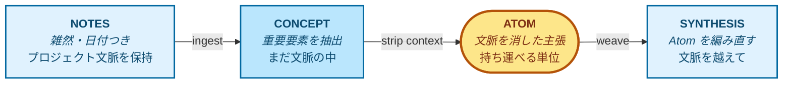

# Graphium（コンセプト）

> **情報を、いつでも再利用可能な「知識」へと変えるノートエディタ。**

このドキュメントは、Graphium がなぜ存在するのか、そして何を考えて作られているのかを説明します。エディタ、ラベル、AI 知識層の背景にある設計思想が中心です。実装の詳細は [ARCHITECTURE.md](./ARCHITECTURE.md) と [DATA_MODEL.md](./DATA_MODEL.md) を参照してください。

> *Last synced with [CONCEPT.md](./CONCEPT.md): 2026-05-06*

---

## 1. 約束したいこと

ほとんどのツールは、情報を「書く」ことを助けてくれます。Graphium は、あなた（そしてあなたが信頼する AI）が数ヶ月後・数年後にも使える形で、情報を「保つ」ために作っています。

私がこのプロダクトに守らせたい一行は、これです。

> **情報を、いつでも再利用可能な「知識」へと変えるノートエディタ。**

このドキュメントにあるすべて（ラベル、Wiki、ファイル形式）は、この一行を実現するための手段です。

## 2. なぜ作っているのか

思考を進める仕事において、ノートを取ること自体は「安い」作業になりがちです。一方で本当に「**高くつく**」のは、数ヶ月後・数年後に自分のページを読み返したときに、こう問われて答えられない瞬間です。

- その数字は、自分が測ったものか、それとも仮定したものか？
- その段落は、自分の言葉か、それとも疲れた午後に LLM が手渡してくれたものか？
- このアイデアに、自分はどんな道のりで辿り着いたのか（どのノートの上に立っているのか）？

研究者、デザイナー、起業家、書き手、エンジニア、学生など、**試行錯誤を重ねて何かを発見しようとするすべての人** が、同じ壁にぶつかります。安く済んだ記録は積み上がり続ける一方で、**答えを取り戻すコスト** は時間とともに膨らんでいくのです。

私自身、この問いにしっくり答えてくれるツールに出会えていませんでした。試した範囲ではどれも自分の使い方とは噛み合わず、自分の手で組み立てるしかないと感じました。

そのときに **最初に置きたいと考えた一手** が、「来歴（provenance）」です。来歴は、後から付け足すような機能ではありません。エディタがテキストを保存するときの「**背骨**」に組み込む必要があります。だからこそ、背骨に W3C [PROV-DM](https://www.w3.org/TR/prov-dm/) を据え、AI 機能にも同じ来歴の道を辿ることを義務づけたエディタを作り始めました。

これは Graphium で **最初に手をつけた軸** であり、§3 で説明する「三つの柱」の一本でもあります。

## 3. 三つの柱

Graphium は、3 つの軸の上に立っています。これらは個別のツールとしては存在しますが、一つのツールに同居している例を、私はあまり見たことがありません。

| 柱 | 意味すること |
|---|---|
| **標準としての来歴** | ブロックレベルのラベル（`[ステップ]` / `[計画]` / `[結果]`）は PROV-DM の *Activity* に、インラインハイライト（`[インプット]` / `[ツール]` / `[パラメータ]` / `[アウトプット]`）は *Entity* と *Property* に対応します。*Agent*（書き手）は編集メタデータから合流します。結果として、ノートが単なる検索インデックスではなく、機械が検証可能な「グラフ」を形成するのです |
| **AI が育てる Wiki** | ノートを取り込み、編集可能な「AI Wiki」（*Concept*, *Atom*, *Synthesis*）を組み立てます。今後の AI との対話はこの Wiki を文脈として読むため、AI の主張は学習データではなく、**あなたのノート** を引用します |
| **「考え途中」のためのブロックエディタ** | [BlockNote.js](https://www.blocknotejs.org/) ベースのエディタを、最初は散らかった状態で書き、後から構造化することを前提に調整しています。自由な記述、`@` リンク、準備ができたときの `#` ラベル付与を、自然な流れで行えます |

> これらの柱の上に乗る便利機能（モバイル収集、同期、チーム共有など）はロードマップ上にあり、現在は停止または一部実装の状態です。本ドキュメントが扱うのは、安定している「基盤」のほうです。

## 4. 二つの脳

考えながら生きている人の中には、二つの脳が共存しています。

一つは、頭の中にある「**ワーキング・ブレイン（活動する脳）**」です。雑然としていて、日付に縛られ、半端な思考や脇道の会話で満ちています。多くのノートツールは、この脳を捉えるところまでは比較的うまくやれます。これは簡単な部分なのです。

もう一つは、「**クリスタライズド・ブレイン（結晶化した脳）**」です。蒸留され、一般化され、持ち運び可能になったもの。教科書が手渡してくれる脳であり、ベテランの同僚が十年かけて築いてきた脳でもあります。プロジェクトをまたぐとき、新しい共同作業に入るとき、AI と話すとき。本当に **備えておきたい** のは、こちらの脳なのです。

多くのノートツールは「活動する脳」を保存しながら、それが「結晶化した脳」であるかのように振る舞います。Graphium は、この二つを別の層として保ち、意図的に橋を架けます。

- **Notes** = 活動する脳。原材料。
- **AI Wiki**（および将来的な Knowledge Pack 出力）= 結晶化した脳。再利用可能。

このプロダクトの要点は、二つの脳のあいだに「**橋**」を架けることです。そして、その橋がどちら側からも辿れる（誰がいつ、どのノートからこの知識を引き出したのか追える）状態を保つことです。

## 5. 砂時計（持ち運び可能な知識が生まれる場所）

Graphium における知識は、横に倒した「砂時計」のような形をしています。流れは **Notes → Concept → Atom → Synthesis**。それぞれの段階で、単位は元のプロジェクトの文脈をだんだん落としていきます。Atom がそのくびれです。文脈がゼロになり、主張が「持ち運べる」かたちに変わる場所なのです。

> 黄色い **Atom** が砂時計のくびれです。青い箱（Notes / Concept / Synthesis）は文脈を運びますが、Atom は運びません。

- **Notes** は文脈ごと運ばれます。日付、失敗、脇道の会話、なぜ火曜の午後にそれをやったのか、まで。
- **Concept** ページは、文脈を維持したまま重要な要素を抽出します。プロジェクトの一部として人間が読める状態です。
- **Atom** は砂時計の「くびれ」です。各 Atom は、それを正当化するノートへの引用が付いた、一つの「文脈に依存しない主張」です。これが、文脈をまたいで **持ち運べる**（=他のプロジェクト・人・AI のもとで再利用される）単位になります。
- **Synthesis** は、プロジェクトを跨いで Atom を編み、再利用可能な形にします。未来のあなた、または未来の AI が、文脈を知らずに手に取れる形です。

この狭い「くびれ」こそが要点なのです。これがないと、片側にプライベートなノートがあり、もう片側に汎用 LLM があるだけで、両者のあいだで知識を移す術がありません。Atom こそが、情報を「再利用可能な知識」へと変えるのです。

## 6. 段階的な開示（必要な分だけ使う）

私が何度も立ち戻る設計判断があります。それは「**ラベル付けは任意である**」ということです。しかも、ラベル付けは独立した二つの層から成ります。

| レベル | 行うこと | 得られるもの |
|---|---|---|
| **ノートのみ** | `@` リンクで書いてつなぐ | ファイルシステム上のリンクされたノート群 |
| **ブロックレベルの構造** | 見出しブロックに `[ステップ]`（または Phase の `[計画]` / `[結果]`）を付ける | 来歴グラフの骨格。何が、どの順で起きたか |
| **インラインの詳細** | ブロック内のテキスト範囲を `[インプット]` / `[ツール]` / `[パラメータ]` / `[アウトプット]` でハイライト | 完全な来歴グラフ。何を使い、どんな条件で、何ができたか |

ブロックレベル層 (`#`) とインライン層は、独立に採用できます。ラベルなしで書き始め、後から `#` だけ付け、必要な箇所にだけインラインの詳細を載せる、という使い方ができます。**全か無かではないのです**。

ラベル付けを強制したくなる誘惑に、私は抗います。この「グラデーション」こそが設計です。多くの人は、重要な実験や決定にはマークを付け、日常の書き物は放っておく、という中間層で過ごすことになるでしょう。それで構わないのです。

AI Wiki にも同じグラデーションが当てはまります。無視することも、ときどき眺めることも、積極的にキュレーションすることも可能で、それぞれの関与の度合いに応じた価値が返ってきます。

## 7. Graphium が「ではない」もの

何で「ある」かを語るために、何で「ない」かも明確にしておきます。

- **汎用 LLM の競合ではない。** モデルを訓練したりホストしたりはしません。あらゆる LLM を、*あなたにとって* 有用にする「基盤」を作っています。
- **クラウドファーストの SaaS ではない。** ローカルファイルが優先です。同期（Google Drive / iCloud / Dropbox の同期フォルダ等）はユーザーの選択であり、必須ではありません。
- **グラフデータベースではない。** 来歴は、書くことの「副産物」として立ち上がるものであり、手で埋めるスキーマではありません。
- **クローズドな形式ではない。** ノートも Wiki も JSON 形式です。私を介さずに読み・差分を取り・grep し・バックアップできます。
- **完成された製品ではない。** 共有・パッケージ化・モバイルなど、いくつかの柱はまだ部分的または停止中です。一度にすべてを約束するよりも、安定した「背骨」を出してそこから育てる道を選びました。

## 8. スタンス（姿勢）

このようなプロジェクトは「長い賭け」です。私はその賭けの中身を、率直にしておきたいと思っています。

- 今後数年で、ノートの価値は「**AI にとっての読みやすさ**」に大きく寄っていく、と私は予想しています。来歴は、ノートが **AI から読まれるときの「誠実さ」** を保つための仕組みです。自分のノートが、出どころを辿れない、もっともらしい文章で埋め尽くされていく事態を防ぐ手段でもあります。
- Graphium は、より大きな構想（**特定のツールに縛られない「知識基盤」**）のための「**スカウト（先遣隊）**」だと考えています。Graphium はあり得る実装の一つに過ぎず、その謙虚さを設計に残しておきたいと思っています。
- 数年つき合えるものを作りたいと思っています。今四半期に出しやすいものを作るつもりはありません。間違いに気づいたら、その都度認めるつもりです。

これは個人で開発しているオープンソース・プロジェクトです。Pull Request、Issue、反対意見をお待ちしています。

これが、私が守ろうとしている一線なのです。このリポジトリにあるすべては、その下流にあります。

---

## 次に読むもの

- [ARCHITECTURE.md](./ARCHITECTURE.md): レイヤー、コンポーネント、配布形態
- [DATA_MODEL.md](./DATA_MODEL.md): ファイル形式、スキーマ、互換性ルール
- [README](../README.md): インストールと起動
