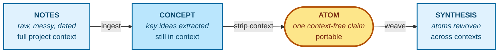

# Graphium — Concept

> **A note editor that turns information into knowledge you can reuse, anytime.**

This document explains *why* Graphium exists and *how it thinks* — the design
philosophy behind the editor, the labels, and the AI knowledge layer. For
implementation details see [ARCHITECTURE.md](./ARCHITECTURE.md) and
[DATA_MODEL.md](./DATA_MODEL.md).

---

## 1. The promise

Most tools help you *write* information. Graphium is built to help you *keep*
it — in a form you, and any AI you trust, can still use months and years
later.

The line I want the product to live up to:

> **A note editor that turns information into knowledge you can reuse, anytime.**

Everything in this document — the labels, the wiki, the file formats — is in
service of that one line.

## 2. Why I built it

Notes tend to be the cheap part of any thinking work. The expensive part
is what happens months or years later, when you re-read your own page and
cannot tell:

- Was that number something you measured, or something you assumed?
- Was that paragraph yours, or did an LLM hand it to you on a tired afternoon?
- How did I arrive at this idea — which earlier notes is it standing on?

Researchers, designers, founders, writers, engineers, students — anyone whose
work is **trial and error toward a discovery** — runs into the same wall. The
cheap part keeps piling up; the expensive part rots.

I never found a tool that fit the way I wanted to keep notes. The ones I
tried were good at their own jobs, just not at mine, so eventually I
decided to build my own.

The first move I wanted to commit to was **provenance**. Provenance is not
a feature you can bolt on later. It has to live in the spine of how the
editor stores text. So I started by giving Graphium a spine of W3C
[PROV-DM](https://www.w3.org/TR/prov-dm/) and obligating its AI features
to travel the same trail.

This is the first axis I committed to, and it is also one of the three
pillars described in §3.

## 3. Three pillars

Graphium sits on three axes that, separately, exist elsewhere — but I have
not seen them together in one tool.

| Pillar | What it means |
|---|---|
| **Provenance, by standard** | Block-level labels (`[Step]`, `[Plan]`, `[Result]`) map to PROV-DM *Activities*; inline highlights (`[Input]`, `[Tool]`, `[Parameter]`, `[Output]`) map to *Entities* and *Properties*; *Agents* come in from authorship metadata. The result is a graph a machine can verify, not just a search index. |
| **A wiki the AI keeps for you** | Graphium ingests your notes into an editable AI Wiki — *Concept*, *Atom*, *Synthesis*. Future AI conversations read from this wiki, so their claims cite your notes, not their training data. |
| **A block editor for thinking-in-progress** | A [BlockNote.js](https://www.blocknotejs.org/)-based editor tuned for messy-now, structured-later: free writing, `@`-linking between notes, `#`-labeling when you are ready. |

> Surface conveniences that sit on top of these pillars (mobile capture, sync,
> team sharing) are on the roadmap and are paused or partial today. This
> document describes the substrate, which is stable.

## 4. The two brains

Two brains live inside any thinking life.

The one in your head is **working** — messy, dated, full of half-finished
thoughts and side conversations. Most notes capture this brain reasonably
well; that is the easy part.

The other brain is **crystallized** — distilled, generalized, portable. It is
the brain a textbook hands you, or the brain a senior colleague has built
over a decade. It is what you actually want to *carry* between projects, into
new collaborations, and into conversations with an AI.

Most note tools store the working brain and pretend it is the crystallized
one. Graphium keeps them as separate layers and connects them on purpose.

- **Notes** = the working brain. Raw material.
- **AI Wiki** (and future Knowledge Pack export) = the crystallized brain.
  Reusable.

The point of the product is the **bridge** between the two — and keeping that
bridge auditable in both directions.

## 5. The hourglass: where portable knowledge is born

Knowledge in Graphium is shaped like an hourglass on its side. The flow goes
**Notes → Concept → Atom → Synthesis**, and the unit at each stage carries
less and less of the original project's context — until the Atom, which is
the narrow waist where context drops to zero and the claim becomes portable.

> The yellow **Atom** is the waist of the hourglass. Blue boxes (Notes,
> Concept, Synthesis) carry context; the Atom does not.

- **Notes** carry full context — dates, mistakes, side conversations, the
  reason you did something on a Tuesday afternoon.
- **Concept** pages extract the load-bearing elements while keeping context,
  so a human can still read them as part of the project they came from.
- **Atom** is the waist. Each Atom is a single context-free claim with
  citations back to the notes that justify it. This is the unit that
  *travels*.
- **Synthesis** weaves Atoms across projects into a portable, reusable shape
  — the form a future you, or a future AI, can pick up cold.

The narrow waist is the whole point. Without it, you have a private notebook
on one side and a generic LLM on the other, but no way to move knowledge
between them. The Atom is what makes information **into** knowledge you can
reuse.

## 6. Progressive disclosure: use as much, or as little, as you need

A core design choice I keep returning to: **the labels are optional, and
they come in two layers you can adopt independently.**

| Level | What you do | What you get |
|---|---|---|
| **Just notes** | Write and link with `@` | A linked notebook on your filesystem |
| **Block-level structure** | Tag heading blocks as `[Step]` (or as a phase: `[Plan]` / `[Result]`) | The skeleton of a provenance graph — what happened, in what order |
| **Inline detail** | Highlight spans inside a block as `[Input]` / `[Tool]` / `[Parameter]` / `[Output]` | A full provenance graph — what was used, with what conditions, what came out |

The block-level layer (`#`) and the inline layer are two passes over the
same content, not a single all-or-nothing label. You can write a note with
no labels at all, give it a step structure later, and add inline detail
only on the parts that matter.

I resist the temptation to make any of it mandatory. The gradient *is* the
design. I expect most people to live in the middle — marking the
experiments and decisions that matter, leaving everyday writing alone — and
I think that is fine.

The same gradient applies to the AI Wiki. You can ignore it, browse it
occasionally, or curate it actively. Each level returns proportional value.

## 7. What Graphium is not

Saying what Graphium is *not* is part of saying what it is.

- **Not a competitor to general-purpose LLMs.** I do not train or host a
  model. I am building the substrate that makes any LLM more useful for
  *you*.
- **Not a cloud-first SaaS.** Local files first. Sync is a user choice
  (Google Drive, iCloud, Dropbox folders), not a requirement.
- **Not a graph database.** PROV-DM is a side-effect of how you write, not a
  schema you fill in by hand.
- **Not a closed format.** Notes are JSON; the wiki is JSON; you can read,
  diff, grep, and back them up without me.
- **Not a finished product.** Several pillars in this document — sharing,
  packs, mobile — are partial or paused. I would rather ship a stable spine
  and grow from it than promise everything at once.

## 8. Stance

A project like this is a long bet, and I try to be explicit about the bets I
am making.

- I expect the value of notes to **shift toward AI-readability** over the
  next few years. Provenance is how I keep that surface honest — how I
  prevent my own notebook from filling up with confident-sounding text whose
  origin I can no longer audit.
- I treat Graphium as a **scout** for a larger idea: a knowledge substrate
  that **isn't locked into any single tool**. Graphium is one
  implementation among possible others, and I want to keep that humility in
  the design.
- I want to **build** something I can live with for years, not something
  that ships easily this quarter. When I get something wrong, I will admit
  it as I notice it.

This is a personal open-source project, built in the open. Pull requests,
issues, and disagreements are welcome — especially the disagreements.

That is the line I hold to. Everything in this repository is downstream of
it.

---

## Where to go next

- [ARCHITECTURE.md](./ARCHITECTURE.md) — layers, components, distribution
- [DATA_MODEL.md](./DATA_MODEL.md) — file formats, schemas, compatibility rules
- [README](../README.md) — install and run
